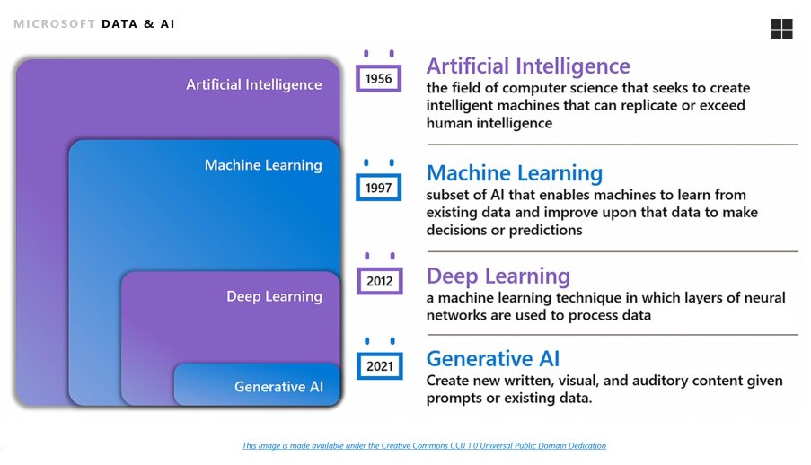
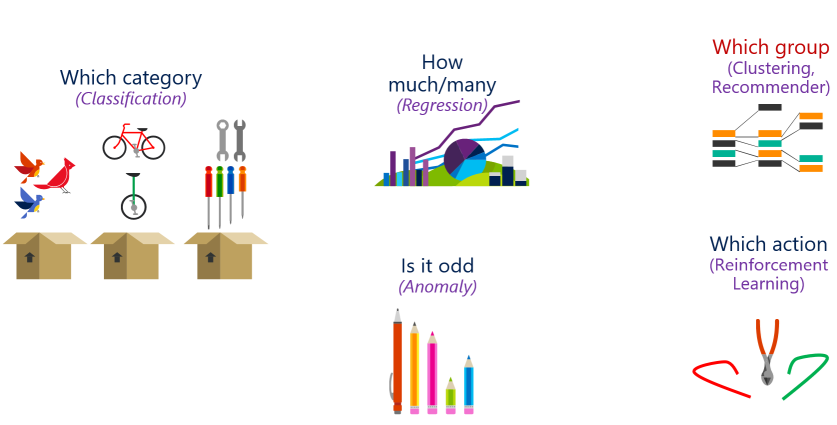
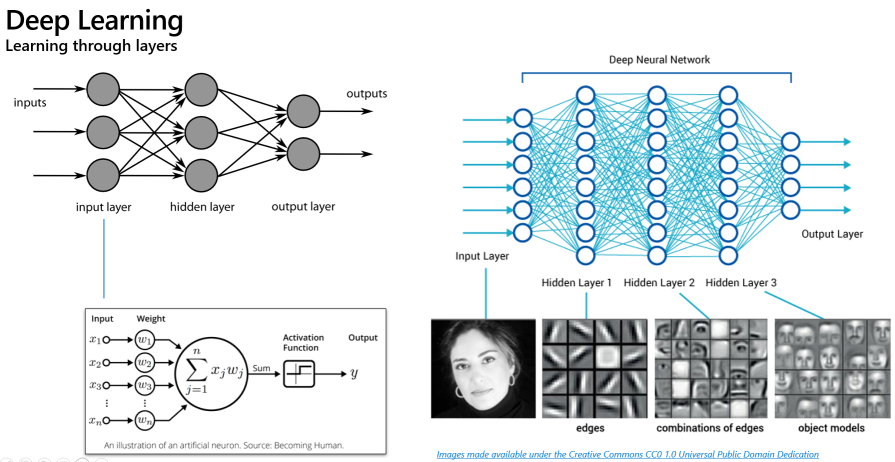
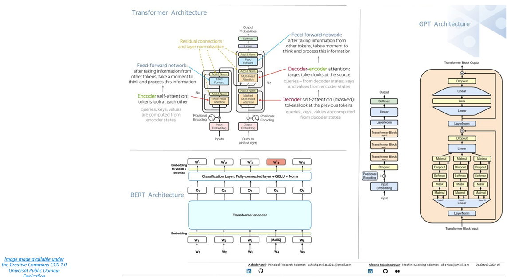

# Workshop: Unlocking AI Potential for the Data Professional with Azure OpenAI

#### <i>A Microsoft Course from Microsoft Engineering and the FastTrack Team</i>

 <h2>Module 01 - Introduction and Overview</h2>

Welcome to this Microsoft solutions workshop on *Unlocking AI Potential for the Data Professional with Azure OpenAI*. In this workshop, you'll learn how to unleash the full potential of artificial intelligence. Whether you’re a seasoned Data Professional or just dipping your toes into the world of machine learning, this course will empower you with the knowledge to create groundbreaking solutions.

In each module you'll get more references, which you should follow up on to learn more. Also watch for links within the text - click on each one to explore that topic.

(<a href="https://github.com/sqlserverworkshops/OpenAI-DataPro/blob/main/sqldev/00%20-%20Pre-Requisites.md" target="_blank">Make sure you check out the <b>Pre-Requisites</b> page before you start</a>. You'll need all of the items loaded there before you can proceed with the workshop.)

<h2>Topics In This Module</h2>

The following topics are covered in this module:

<dl>

  <dt><a href="#1.1" target="_blank">1.1 - Artificial Intelligence Concepts</a><dt>
  <dt><a href="#1.2" target="_blank">1.2 - Predictive AI Methods</a><dt>
  <dt><a href="#1.3" target="_blank">1.3 - Machine Learning</a><dt>
  <dt><a href="#1.4" target="_blank">1.4 - Deep Learning</a><dt>
  <dt><a href="#1.5" target="_blank">1.5 - Natural Language Processing (NLP)</a><dt>
  <dt><a href="#1.6" target="_blank">1.6 - Generative AI (GPT)</a><dt>

</dl>

<h2 id="1.1">1.1 - Artificial Intelligence Concepts</h2>

Artificial Intelligence is a field of computer science that aims to create systems capable of performing tasks that normally require human intelligence, such as visual perception, speech recognition, decision-making, and translation between languages. In this workshop, we will focus on the following general areas of the AI landscape: 

- Artificial Intelligence: Distinguished by input systems, any mathematical technique that mimics human behavior
- Machine Learning: Using combinations of mathematical formulae to act over data, improving a prediction or classification from that data
- Deep Learning: Using specialized layers of algorithms to train a model through the layers to create a prediction or classification
- Generative Artificial Intelligence: A subset of AI technologies that are capable of creating new content or data, such as images, text, or music, often by learning patterns from existing data and then generating similar, but original, outputs.

 

 

Artificial Intelligence (AI) is a branch of computer science that aims to create systems capable of performing tasks that would normally require human intelligence. These tasks include learning, reasoning, problem-solving, perception, and language understanding.

There are some interesting primary concepts and milestones in the field of AI that you should familiarize yourself with as we move through the course:

**1. Turing Test:** - In the early days of AI, Alan Turing proposed a test to measure a machine's ability to exhibit intelligent behavior equivalent to, or indistinguishable from, human behavior. This test is known as the Turing Test.

**2. Symbolic AI:** - Also known as "Good Old-Fashioned AI (GOFAI)", this approach relies on explicit symbols and rules for its representations and computations. It was dominant in the mid-20th century and was used in programs for logic-based reasoning and problem-solving.

**3. Machine Learning:** - Machine Learning (ML) is a subset of AI that provides systems the ability to learn and improve from experience without being explicitly programmed. It focuses on the development of algorithms that can learn from and make predictions or decisions based on data.

**4. Deep Learning:** - Deep Learning is a subset of ML that makes the computation of multi-layer neural networks feasible. It is responsible for advances in image and speech recognition, and it's the technology behind driverless cars.

**5. Natural Language Processing (NLP):** - NLP is a field of AI that gives the machines the ability to read, understand, and derive meaning from human languages.

**6. Generative AI:** - Generative AI, inlcuding Large Language Models or LLM's, are fields of AI that create new content .

AI continues to evolve and has a promising future with the potential to bring significant changes to various fields such as healthcare, finance, transportation, and more. Remember, each of these concepts is a vast field in itself and this Module is just a brief overview.

<b>Activity: AI in Action</b>

In this section you will review a Jupyter Notebook that uses a Python Kernel to run code illustrating a few of the "GOAFI" or Good Old-Fashioned AI concepts. You can also download this Notebook to your local system and modify it for your learning journey.

<b>Steps</b>

- [Open this Jupyter Notebook](https://github.com/sqlserverworkshops/OpenAI-DataPro/blob/main/notebooks/Notebook%20-%20Module%201.ipynb) and look for the "Cell" description **Artificial Intelligence: Simple "Expert System"**. You can review the results from the instructions and code. You can also download the Notebook and enter your own credentials and other variables to run it on your system once you have [completed the pre-requisites](https://github.com/sqlserverworkshops/OpenAI-DataPro/blob/main/sqldev/00%20-%20Pre-Requisites.md).

<h2 id="1.2">1.2 - Predictive Analytics in AI Methods</h2>

Predictive AI methods are techniques used in artificial intelligence to make predictions about future outcomes based on historical data. These methods are newer than the earlier symbolic methods, and they are often still used in machine learning and data mining. Here are a few examples:

1. **Regression Analysis:** This is a statistical method used to predict a dependent variable based on independent variables. For example, predicting house prices based on features like location, size, and age.

2. **Time Series Forecasting:** This method is used when data is collected over time and the sequence of data points is important. For example, predicting stock prices or weather conditions.

3. **Classification:** This is used to predict categorical outcomes. For example, predicting whether an email is spam or not.

<h3>Bayesian Decision Theory</h3>

A particulaly inmportant concept in Predictive AI is *Bayesian Decision Theory* - a fundamental statistical approach to the problem of pattern classification. It provides a framework for making decisions under uncertainty. The theory combines the use of a likelihood function with a prior probability distribution to make decisions.

The main steps in Bayesian Decision Theory are:

1. **Prior Probability:** This is the initial belief before evidence is taken into account. For example, the probability that it will rain tomorrow.

2. **Likelihood:** This is the probability of the evidence given the hypothesis. For example, the probability of seeing dark clouds given that it will rain.

3. **Posterior Probability:** This is the probability of the hypothesis given the evidence. It is calculated using Bayes' theorem. For example, the probability that it will rain given that there are dark clouds.

In the context of AI, Bayesian Decision Theory can be used to make predictions and decisions. For example, in a spam filter, Bayesian Decision Theory can be used to calculate the probability that an email is spam given the words in the email.

<b>Activity: Predictive Analytics in AI</b>

In this section you will review a Jupyter Notebook that uses a Python Kernel to run code illustrating Bayesian Decision concepts. You can also download this Notebook to your local system and modify it for your learning journey.

<b>Steps</b>

- [Open this Jupyter Notebook](https://github.com/sqlserverworkshops/OpenAI-DataPro/blob/main/notebooks/Notebook%20-%20Module%201.ipynb) and look for the "Cell" description **Artificial Intelligence: Descision tree using simple Bayesian Decision Theory**. You can review the results from the instructions and code. You can also download the Notebook and enter your own credentials and other variables to run it on your system once you have [completed the pre-requisites](https://github.com/sqlserverworkshops/OpenAI-DataPro/blob/main/sqldev/00%20-%20Pre-Requisites.md).

<h2 id="1.3">1.3 - Machine Learning</h2>

Machine learning is a **subfield of artificial intelligence (AI)** that empowers computers to learn and adapt without explicit programming. Unlike traditional software, which relies on predefined rules and instructions, machine learning systems learn from data and experiences. Imagine it as a digital apprentice that observes patterns, generalizes from examples, and improves its performance over time. 

At its core, machine learning involves **algorithms** that analyze data, identify patterns, and make predictions. You can see a few types of those algorithms here: 

 

 

Here's a simplified breakdown of the process how those algorithm "families:" or groups are used:

1. **Data Collection**: ML begins with a dataset containing examples relevant to the problem at hand. These examples could be labeled (with known outcomes) or unlabeled (without specific outcomes).

2. **Feature Extraction**: The dataset is transformed into a format that the ML algorithm can understand. Features (attributes) are extracted from the data, representing different aspects of the problem.

3. **Algorithm Training**: The ML model is trained using the labeled data. During training, the algorithm adjusts its internal parameters to minimize prediction errors. It learns to recognize patterns and relationships within the features.

4. **Model Evaluation**: After training, the model is evaluated using a separate set of data (the validation or test set). This helps assess its performance and generalization ability. If the model performs well, it's ready for deployment.

5. **Prediction and Generalization**: Once deployed, the ML model can make predictions on new, unseen data. It generalizes from its training examples to handle real-world scenarios. For instance, it can predict customer preferences, diagnose diseases, or recommend personalized content.

There are several ML paradigms, each suited to different tasks:

1. **Supervised Learning**: In this approach, the model learns from labeled examples. It predicts outcomes based on input features. Common tasks include regression (predicting numerical values) and classification (assigning labels).

2. **Unsupervised Learning**: Here, the model works with unlabeled data. It discovers hidden patterns, clusters similar data points, and reduces dimensionality. Examples include clustering and dimensionality reduction.

3. **Semi-Supervised Learning**: A hybrid approach that combines labeled and unlabeled data. It leverages both to improve model performance.

4. **Reinforcement Learning**: Inspired by behavioral psychology, reinforcement learning trains models through trial and error. Agents learn by interacting with an environment and receiving rewards or penalties.

Machine learning is used in many applications, such as:
- **Natural Language Processing (NLP)**: Chatbots, language translation, and sentiment analysis.
- **Computer Vision**: Image recognition, object detection, and autonomous vehicles.
- **Recommendation Systems**: Personalized content on platforms like Netflix and Amazon.
- **Healthcare**: Diagnosing diseases from medical images.
- **Finance**: Fraud detection and stock market predictions.

Machine Learning, however, isn't infallible. It can be biased, overfit to training data, or fail in novel situations. Ethical considerations are crucial, and understanding ML's limitations is essential for responsible adoption.

<b>Activity: Machine Learning</b>

In this section you will review a Jupyter Notebook that uses a Python Kernel to run code illustrating Bayesian Decision concepts. You can also download this Notebook to your local system and modify it for your learning journey.

<b>Steps</b>

- [Open this Jupyter Notebook](https://github.com/sqlserverworkshops/OpenAI-DataPro/blob/main/notebooks/Notebook%20-%20Module%201.ipynb) and look for the "Cell" description **Machine Learning: Predicting results from data**. You can review the results from the instructions and code. You can also download the Notebook and enter your own credentials and other variables to run it on your system once you have [completed the pre-requisites](https://github.com/sqlserverworkshops/OpenAI-DataPro/blob/main/sqldev/00%20-%20Pre-Requisites.md).

<h2 id="1.4">1.4 - Deep Learning</h2>

Deep learning is a **subfield of machine learning** that harnesses the power of **multi-layered neural networks**—aptly named **deep neural networks**—to mimic the intricate decision-making capabilities of the human brain. These networks consist of three or more layers (though in practice, they often have many more). Unlike single-layer neural networks, which can make approximate predictions, deep neural networks refine and optimize outcomes for greater accuracy.

How Deep Learning Works:
1. **Data Collection and Preparation**:
   - Deep learning begins with a **dataset**, containing examples relevant to the problem at hand. These examples can be labeled (with known outcomes) or unlabeled.
   - Unlike traditional machine learning, deep learning **automates feature extraction**. It can handle **unstructured data** such as text, images, and audio without extensive pre-processing.
   - For instance, consider a set of animal photos. Deep learning algorithms can automatically identify crucial features (like ears) to distinguish cats, dogs, hamsters, and more.

2. **Training the Deep Neural Network (DNN)**:
   - The DNN is trained using **large amounts of data**. It learns to recognize patterns, relationships, and nuances.
   - Through processes like **gradient descent** and **backpropagation**, the DNN adjusts its internal parameters to improve accuracy.
   - The hierarchy of features, which in traditional machine learning is manually established by human experts, emerges organically in deep learning.

3. **Model Evaluation and Deployment**:
   - After training, the deep learning model is evaluated using a separate validation or test set.
   - Once validated, the model is ready for deployment. It can process new, unseen data and make predictions.
   - Deep learning powers everyday technologies like **digital assistants**, **voice-enabled remotes**, and **credit card fraud detection**. It also fuels emerging innovations like **self-driving cars** and **generative AI**.

**Deep Learning vs. Machine Learning**
Deep learning distinguishes itself from classical machine learning in two key ways:
- **Data Handling**: While machine learning relies on structured, labeled data, deep learning can directly process **unstructured data** (such as images and text) without extensive pre-processing.
- **Automated Feature Extraction**: Deep learning algorithms automatically extract relevant features, reducing dependency on human experts. This automation enhances precision and efficiency.

 

 

<b>Activity: TODO: Activity Name</b>

TODO: Activity Description and tasks

<b>Steps</b>

- [Open this Jupyter Notebook](https://github.com/sqlserverworkshops/OpenAI-DataPro/blob/main/notebooks/Notebook%20-%20Module%201.ipynb) and review the results from the instructions and code. You can download the Notebook and enter your own credentials and other variables to run it on your system once you have [completed the pre-requisites](https://github.com/sqlserverworkshops/OpenAI-DataPro/blob/main/sqldev/00%20-%20Pre-Requisites.md).

<h2 id="1.5">1.5 - Natural Language Processing (NLP)</h2>

Natural Language Processing (NLP) is an intersection of **computational linguistics**, **machine learning**, and **artificial intelligence**. It is used to bridge the gap between human communication and computer understanding. NLP empowers computers to interpret, analyze, and generate human language, enabling seamless interaction between humans and machines.

**How NLP Works**
1. **Data Ingestion and Preparation**:
   - NLP begins with a **dataset**—a collection of text or voice data. This data can be structured (like articles or tweets) or unstructured (like spoken conversations).
   - Unlike structured data, where columns and rows neatly organize information, natural language data is messy. It's filled with **ambiguities**, **idioms**, **slang**, and **variations**.
   - NLP algorithms must learn to navigate this linguistic complexity.

2. **Tasks in NLP**:
   - **Speech Recognition (Speech-to-Text)**: Converting spoken words into written text. This task is essential for voice-operated systems and applications that respond to spoken commands.
   - **Part of Speech Tagging (Grammatical Tagging)**: Determining the grammatical role of each word in a sentence. For example, identifying whether "make" is a verb in "I can make a paper plane" or a noun in "What make of car do you own?"
   - **Word Sense Disambiguation**: Resolving multiple meanings of a word based on context. For instance, distinguishing between "make the grade" (achieve) and "make a bet" (place).

3. **Statistical and Machine Learning Models**:
   - NLP combines **rule-based approaches** (where linguistic rules guide analysis) with **statistical models** and **machine learning**.
   - **Neural networks** have also made significant strides in NLP, especially with deep learning architectures like **transformers**.
   - These models learn from labeled data, adjusting their internal parameters to improve accuracy.

4. **Applications of NLP**:
   - **Translation**: NLP powers language translation tools, breaking down language barriers.
   - **Chatbots and Virtual Assistants**: Think Siri, Alexa, or customer service chatbots—they rely on NLP to understand and respond to user queries.
   - **Sentiment Analysis**: Assessing the emotional tone of text (positive, negative, neutral) in social media posts, reviews, or news articles.
   - **Text Summarization**: Automatically condensing lengthy documents into concise summaries.
   - **Named Entity Recognition**: Identifying entities like people, places, dates, and organizations in text.

5. **Challenges and Future Directions**:
   - **Context**: NLP struggles with context, especially in complex sentences or ambiguous phrases.
   - **Bias**: Models can inherit biases present in training data.
   - **Multilingual NLP**: Handling diverse languages and dialects remains an ongoing challenge.

 

 

<b>Activity: TODO: Activity Name</b>

TODO: Activity Description and tasks

<b>Description</b>

TODO: Enter activity description with checkbox

<b>Steps</b>

TODO: Enter activity steps description with checkbox

<h2 id="1.6">1.6 - Generative AI</h2>

Generative AI is a branch of artificial intelligence that focuses on creating new content based on patterns and examples from existing data. Imagine an AI that crafts captivating stories, generates stunning images, or even composes music—all autonomously. Generative AI enables machines to unleash their creative prowess by producing fresh, novel content. It combines all of the concepts you have seen so far in this Module, and adds new concepts that are shown below in the process of how it works. 

> Note: There's a lot to learn here, and Generative AI is a very recent field that is changing very rapidly. You can use this Topic as a good basis for some of the major concepts, but further study is warranted to understand it well. 

How Generative AI Works:
1. **Deep Learning and Neural Networks**:
   - Generative AI leverages **deep learning**, specifically **neural networks**, to analyze vast datasets and then create new content.
   - Neural networks are inspired by the human brain's ability to process information, learn from patterns, and make connections over time.

2. **Understanding Embeddings and Language Models**:
   - At the heart of Generative AI lies **vectors**. These vectors represent words or tokens (sub-word parts) in a language.
   - Each word has a vector representation—a long array of learned numerical values. These vectors capture semantic meaning.
   - Generative AI models learn from the information they're fed, including elements like plot structures, characters, and themes from literature.

3. **The Role of Encoders and Decoders**:
   - **Encoders** extract features from input sentences. They encode the essence of the text.
   - **Decoders** take these features and produce an output sentence. For instance, in translation tasks, the decoder generates the translated text.
   - Together, encoders and decoders form the backbone of generative AI architectures.

4. **The Transformer Architecture**:
   - The **transformer** revolutionized generative AI. It introduced the concept of **self-attention**.
   - Self-attention allows the model to selectively focus on different parts of the input sequence when generating each element of the output sequence.
   - Transformers consist of **encoder-decoder pairs**, where the encoder processes input data, and the decoder generates the desired output.
   - The transformer's power lies in its ability to handle long-range dependencies and capture context effectively.

5. **Examples of Generative AI Models**:
   - **ChatGPT**: An AI language model that answers questions and generates human-like responses from text prompts.
   - **DALL-E**: A model that creates images from textual descriptions, showcasing the fusion of language and visual creativity.
   - **Music Generation Models**: These models compose melodies, harmonies, and even entire symphonies.
   - **Text Summarization Models**: They condense lengthy documents into concise summaries.

Generative AI opens doors to creativity, personalization, and automation. However, it also faces challenges like bias, ethical considerations, and the need for robust evaluation.

 

 

<b>Activity: TODO: Activity Name</b>

TODO: Activity Description and tasks

<b>Steps</b>

- [Open this Jupyter Notebook](https://github.com/sqlserverworkshops/OpenAI-DataPro/blob/main/notebooks/Notebook%20-%20Module%201.ipynb) and review the results from the instructions and code. You can download the Notebook and enter your own credentials and other variables to run it on your system once you have [completed the pre-requisites](https://github.com/sqlserverworkshops/OpenAI-DataPro/blob/main/sqldev/00%20-%20Pre-Requisites.md).

<b>For Further Study</b>

<ul>
    <li><a href="url" target="_blank">TODO: Enter courses, books, posts, whatever the student needs to extend their study</a></li>

  Some great cheat-sheets for the concepts here - https://becominghuman.ai/cheat-sheets-for-ai-neural-networks-machine-learning-deep-learning-big-data-science-pdf-f22dc900d2d7
  Good overview - https://www.geeksforgeeks.org/artificial-intelligence-an-introduction
  
</ul>

Congratulations! You have completed this Module.<a href="https://github.com/sqlserverworkshops/OpenAI-DataPro/blob/main/sqldev/02%20-%20Implementing%20AI%20Studio.md"> Click this link to continue to the next Module in the Workshop</a>.
