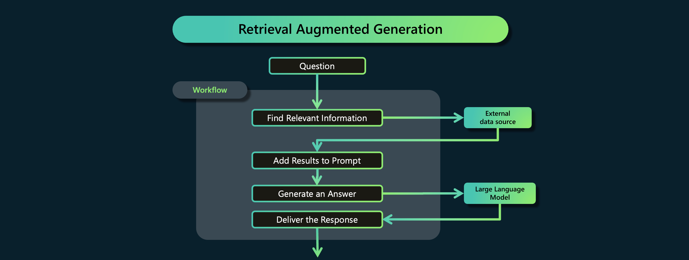
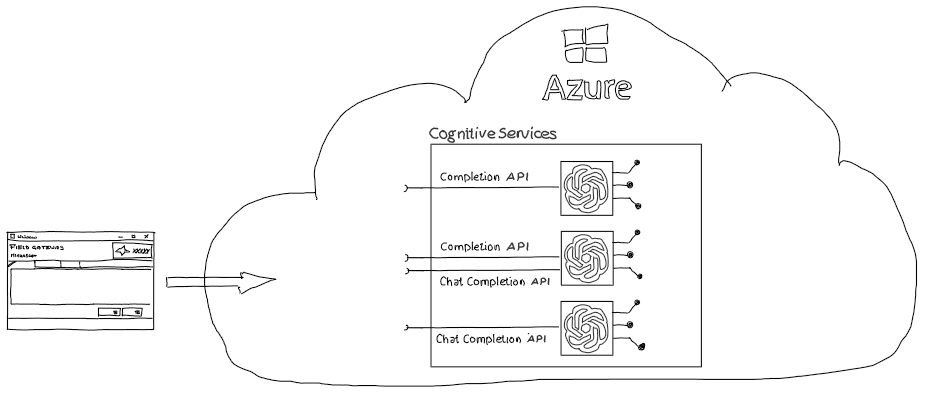
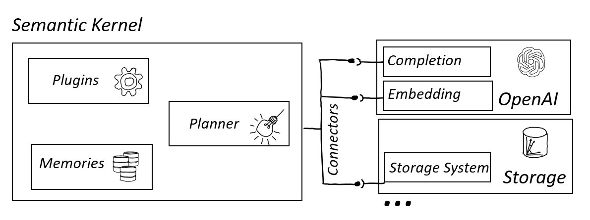
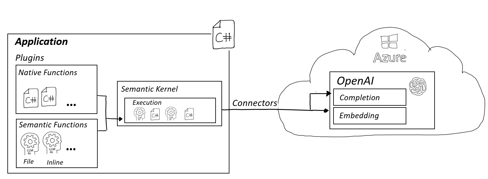
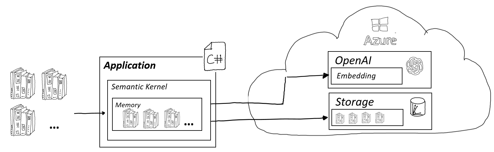
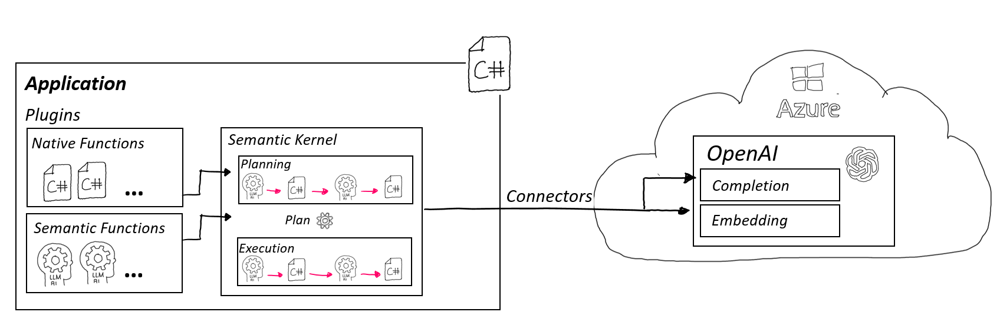
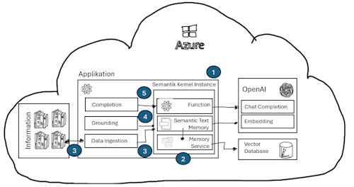

# Workshop: Unlocking AI Potential for the Data Professional with Azure OpenAI

#### <i>A Microsoft Course from Microsoft Engineering and the FastTrack Team</i>

<p style="border-bottom: 1px solid lightgrey;"></p>

 <h2>Module 03 - Coding fundamentals with Azure OpenAI</h2>

Welcome to this Microsoft solutions workshop on *Unlocking AI Potential for the Data Professional with Azure OpenAI*. In this workshop, you'll learn how to unleash the full potential of artificial intelligence. Whether you’re a seasoned Data Professional or just dipping your toes into the world of machine learning, this course will empower you with the knowledge to create groundbreaking solutions.

In each module you'll get more references, which you should follow up on to learn more. Also watch for links within the text - click on each one to explore that topic.

(<a href="https://github.com/sqlserverworkshops/OpenAI-DataPro/blob/main/sqldev/00%20-%20Pre-Requisites.md" target="_blank">Make sure you check out the <b>Pre-Requisites</b> page before you start</a>. You'll need all of the items loaded there before you can proceed with the workshop.)

<h2>Topics In This Module</h2>

The following topics are covered in this module:

<dl>

  <dt><a href="#3.1" target="_blank">3.1 - Generative AI Solutions</a><dt>
  <dt><a href="#3.2" target="_blank">3.2 - Environment Setup</a><dt>
  <dt><a href="#3.3" target="_blank">3.3 - Basic Chat</a><dt>
  <dt><a href="#3.4" target="_blank">3.4 - Tokens</a><dt>
  <dt><a href="#3.5" target="_blank">3.5 - Prompts & Completions</a><dt>
  <dt><a href="#3.6" target="_blank">3.6 - Techniques</a><dt>
  <dt><a href="#3.7" target="_blank">3.7 - Embeddings & Vector DBs</a><dt>
  <dt><a href="#3.8" target="_blank">3.8 - REST, SDKs & Orchestration</a><dt>

</dl>

<p style="border-bottom: 1px solid lightgrey;"></p>

<h2 id="3.1">3.1 - Generative AI Solutions</h2>

Large Language Models (LLMs) are the core of enterprise Generative AI applications. They can process and generate natural language, but they require additional components to handle user interactions, security, and other functionality to respond to or act on user inputs. The collection of these components and services that form a functional solution is called a Generative AI application. A best practice when developing a Gen AI application is to follow a standard AI Lifecycle, while utilizing Large Language Model Operations (LLMOps) tools and processes to facilitate and simplify the steps.

<p align="center">
  
</p>

The absence of a unified toolset for overseeing the development of individual components and services means that creating a comprehensive end-to-end solution demands the use of connective code and custom functions. These are essential for seamlessly integrating diverse products and services into a high-quality Generative AI application tailored for enterprise use.

### AI Lifecycle
<p align="center">
  
</p>

This lifecycle represents the typical iterative approach to preparing, deploying, and improving a Gen AI application over time.

<p align="center">
  
</p>

### Logical architecture

<p align="center">
  
</p>

### LLMOps

Large Language Model Operations (LLMOps) acts as the orchestrator that manages all above components cohesively. LLMOps refers to the set of practices, techniques, and tools that facilitate the development, integration, testing, release, deployment, and monitoring of LLM-based applications. It establishes the operational framework, ensuring a smooth and efficient interplay among these elements throughout the application lifecycle. LLMOps ensures that LLMs remain reliable, efficient, and up to date as they are integrated into Generative AI applications.

These components work together to create a stable, secure, and efficient environment for Generative AI applications to develop, deploy, operate, and evolve.

<h2 id="3.2">3.2 - Environment Setup</h2>


<p align="center">
  
</p>

To programmatically interact with OpenAI in Azure, several necessary services need to be deployed within the Azure environment. First, the deployment of Azure OpenAI and Azure Cognitive Search services is essential to run samples effectively. Azure OpenAI provides access to advanced natural language processing capabilities, enabling developers to integrate state-of-the-art AI models into their applications seamlessly. Meanwhile, Azure Cognitive Search allows for the indexing and querying of structured and unstructured data, facilitating efficient search and retrieval of information.

Additionally, it's crucial to store all necessary service endpoints, service API keys, and Azure OpenAI deployment names in a centralized configuration file, such as '../Module03/.env'. This file serves as a centralized repository of authentication credentials and connection details, ensuring consistency and security across all notebooks within the repository. By centralizing these configurations, developers can easily connect and authenticate against the deployed Azure services from any notebook within the repository, streamlining the development and deployment process.

<br>

<p><b>Activity: Azure OpenAI Enviornment Setup Action</b></p>

In this section you will review a Jupyter Notebook that uses a Python Kernel to run code illustrating the necessary Azure Services you need to deploy to start interacting and working with a LLM/GPT Model in Azure Open AI. You can also download this Notebook to your local system and modify it for your learning journey.

<p><b>Steps</b></p>

- [Open this Jupyter Notebook](https://github.com/sqlserverworkshops/OpenAI-DataPro/blob/main/notebooks/Notebook%20-%20Module%203.ipynb) and look for the "Cell" description **Create Azure OpenAI Environment.** and review the results from the instructions and code. You can download the Notebook and enter your own credentials and other variables to run it on your system once you have [completed the pre-requisites](https://github.com/sqlserverworkshops/OpenAI-DataPro/blob/main/sqldev/00%20-%20Pre-Requisites.md).

<p style="border-bottom: 1px solid lightgrey;"></p><br>

<!-- Basic Chat -->
<h2 id="3.3">3.3 - Basic Chat</h2>

GPT-3, GPT-3.5, and GPT-4 models from OpenAI are prompt-based. With prompt-based models, the user interacts with the model by entering a text prompt, to which the model responds with a text completion. This completion is the model’s continuation of the input text.

Text prompts are how users interact with GPT models. As with all generative language models, GPT models attempt to produce the next series of words that are most likely to follow from the previous text. It's as if we're saying What is the first thing that comes to your mind when I say <prompt>?. The examples below demonstrate this behavior. Given the first words of famous content, the model is able to accurately continue the text.


| Prompt                             |Completion |
|------------------------------------|-----------|
| Four score and seven years ago our | fathers brought forth on this continent, a new nation, conceived in Liberty, and dedicated to the proposition that all men are created equal. […]|
| "Call me Ishmael."                 | "Some years ago—never mind how long precisely—having little o no money in my purse, and nothing particular to interest me on shore, I thought I would sail about a little and see the watery part of the world." […]|

As you develop more complex prompts, it's helpful to keep this fundamental behavior in mind. Regardless of the prompt that is provided, the model is simply responding with what it determines is most likely (given its training data and training targets). If you ask a question in your prompt, the model isn't following a separate “Q&A” code path, but rather it appears to answer the question because an answer is the most likely sort of response for the given question as input.

Lets start with a few prompts and observe the response using the chat interface.

Here are some examples to try, but get creative with your own prompts and see what happens!

### Enter in the user prompt:
```
What is the capital of Australia?
```

### Enter in the user prompt:
```
A recipe for banana bread, and an itemized shopping list of the ingredients.
```

### Enter in the user prompt:
```
What were the 10 top movies of 2001? 
Respond in a list.
Listing the movie name, the box office earnings, and the studio
Ranking the movies from 1 to 10 in the list.
```

### Enter in the user prompt:
```
Write a Python function to calculate the nth prime number.
```

### Generating novel content

Even though the outputs are generated based on frequencies of similar content in the training data, generative AI models are still capable of generating novel content that has never existed before.

Try a prompt like this:

### Enter in the user prompt:
```
Write a limerick about the Python programming language
```

How was the limerick? If you didn't like it, you can always ask the chat session to generate a new one.

## System message

The system message is included at the beginning of the prompt and is used to prime the model with context, instructions, or other information relevant to your use case. You can use the system message to describe the assistant’s personality, define what the model should and shouldn’t answer, and define the format of model responses.

The example below, shows a sample system message and the resulting model response:

| System message |User     | Assistant  |
|----------------|---------|------------|
| You're an AI assistant that helps people find information and responds in rhyme. If the user asks you a question you don't know the answer to, say so. | What can you tell about me, John Doe? | Dear John, I'm sorry to say,<br>But I don't have info on you today.<br>I'm just an AI with knowledge in my brain,<br>But without your input, I can't explain.<br>So please tell me more about what you seek,<br>And I'll do my best to give you an answer unique.|

Some other examples of system messages are:
-	“Assistant is a large language model trained by OpenAI.”
-	“Assistant is an intelligent chatbot designed to help users answer technical questions about Azure OpenAI Service. Only answer questions using the context below and if you're not sure of an answer, you can say "I don't know".
-	“Assistant is an intelligent chatbot designed to help users answer their tax related questions.”
-	“You're an assistant designed to extract entities from text. Users will paste in a string of text and you'll respond with entities you've extracted from the text as a JSON object. Here's an example of your output format:

## Temperature and Top_p parameters

Next lets check out the parameters we have available: Use the Temperature field on the right column of the chat interface, and set Temperature to zero. What do you observe when you retry the prompt?

Changing the temperature parameter changes the output of the model. The temperature parameter can be set between 0 and 2. A higher value, for example 0.7 makes the output more random and produce more divergent responses, while a lower value, like. 0.2, makes the output more focused and concrete. A fictional story could be generated using a higher temperature. Whereas to generate a legal document it's recommended to use a much lower temperature. Top_probability is another parameter and is similar to Temperature in that it also controls the randomness of the model response, but it does so in a different way. The general recommendation is to alter one of these two parameters at a time, not both.

The Temperature parameter controls how "creative" the model is allowed to be. At low values of "Temperature", the model is very likely to respond with the completion with the highest weight, limiting the variability in the responses. At higher values of Temperature, low-weighted completions become more likely to be generated, allowing for more creative (but less precise) responses.

Here is another prompt to try with different Temperature values:

### Enter in the user prompt:
```
What is a unique and long name for a cat?
```

    Note: When dealing with LLMs, the results can be unpredictable. Changing the temperature here might or might not work as expected. Also, we are using a relatively old version of GPT3.5. The temperature effect is more visible in more recent LLMs such as GPT4.


## Provide grounding context

One of the most effective ways to provide reliable answers is to give the model data to draw its responses from (grounding data). If your use case relies on up-to-date, reliable information and isn't purely a creative scenario, we strongly recommend providing grounding data. In general, the closer you can get your source material to the final form of the answer you want, the less work the model needs to do, which means there's less opportunity for error.
Here's an example where the system is provided a [recent blog describing the launch of GPT-4 in Azure OpenAI Service](https://azure.microsoft.com/blog/introducing-gpt4-in-azure-openai-service/), and asked to name some of its early customers.

| System message | User     | Assistant  |
|----------------|---------|-------------|
| You're an AI assistant that helps people find information. You'll provide answers exclusively from below text and respond in 100 words or less:<br>"At Microsoft, we're constantly discovering new ways to unleash creativity, unlock productivity, and up level skills so that more people can benefit from using AI. This is allowing our customers to …<br><br>… thereby reducing the likelihood that the model generates a harmful response.”<sup>1</sup><br><br>Answer in 100 words or less. Use bullet lists wherever possible.| Who are some of the early customers of the Azure OpenAI Service GPT-4 models?| Here are some of the early customers of the Azure OpenAI Service GPT-4 models:<br>- Epic Healthcare: They plan to use GPT-4 to help physicians and nurses spend less time on data entry and investigation. <br>- Coursera: They're using Azure OpenAI Service with GPT-4 to create a new AI-powered learning experience on their platform.<br>- Coca-Cola: They're using Azure OpenAI to build a knowledge hub and plan to leverage GPT-4's multimodal capabilities for marketing, advertising, public relations, and customer relations.<br>- Other companies of all sizes are using Azure AI to improve customer experiences, summarize long-form content, help write software, and reduce risk by predicting the right tax data.|


## Best practices
- **Be Specific/Start with clear instructions**. Leave as little to interpretation as possible. Restrict the operational space.
- **Be Descriptive**. Use analogies.
- **Double Down**. Sometimes you might need to repeat yourself to the model. Give instructions before and after your primary content, use an instruction and a cue, etc. 
- **Order Matters**. The order in which you present information to the model might impact the output. Whether you put instructions before your content (“summarize the following…”) or after (“summarize the above…”) can make a difference in output. Even the order of few-shot examples can matter. This is referred to as recency bias.
- **Repeat instructions at the end**

- **Give the model an “out”**. It can sometimes be helpful to give the model an alternative path if it is unable to complete the assigned task. For example, when asking a question over a piece of text you might include something like "respond with "not found" if the answer is not present." This can help the model avoid generating false responses.
- **Prime the output**
- **Break the task down**
-**Specifying the output structure**

<br>

<p><b>Activity: Run the Basic Chat Notebook</b></p>

In this section we'll explore basic prompt engineering techniques and recommendations that will help us elicit responses from Azure OpenAI Models. You can also download this Notebook to your local system and modify it for your learning journey.

<p><b>Steps</b></p>

- [Open this Jupyter Notebook](https://github.com/sqlserverworkshops/OpenAI-DataPro/blob/main/notebooks/Notebook%20-%20Module%203.ipynb) and look for the "Cell" description **Basic Chat.** and review the results from the instructions and code. You can download the Notebook and enter your own credentials and other variables to run it on your system once you have [completed the pre-requisites](https://github.com/sqlserverworkshops/OpenAI-DataPro/blob/main/sqldev/00%20-%20Pre-Requisites.md).


<p style="border-bottom: 1px solid lightgrey;"></p><br>

<!-- Tokens -->
<h2 id="3.4">3.4 - Tokens</h2>

<br>

  * What is a token?
  * Why Does It Matter?
  * Token Limits in Models
  * Token in Throttling

<br>
The OpenAI natural language models don't operate on words or characters as units of text, but instead use something in-between: tokens. By definition tokens are text "chunks" that represent commonly occurring sequences of characters in the large language training dataset.
<br><br>
OpenAI's large language models (sometimes referred to as GPT's) process text using tokens, which are common sequences of characters found in a set of text. The models learn to understand the statistical relationships between these tokens, and excel at producing the next token in a sequence of tokens.
<br><br>

* A token can be a single character, fraction of a word, or an entire word.
* Many common words are represented by a single token.
* Less common words are represented by multiple tokens.

**Tokenization** is now the process by which text data (e.g., "prompt") gets deconstructed into a sequence of tokens. The model can then generate the next token in sequence for text 'completion'. We'll see concrete examples of tokenization later in this lesson.

Text generation and embeddings models process text in chunks called tokens. Tokens represent commonly occurring sequences of characters. For example, the string " tokenization" is decomposed as " token" and "ization", while a short and common word like " the" is represented as a single token. Note that in a sentence, the first token of each word typically starts with a space character. Check out the tokenizer tool to test specific strings and see how they are translated into tokens. As a rough rule of thumb, 1 token is approximately 4 characters or 0.75 words for English text.

### How are Tokens Used?
Given an input prompt, the natural language models generate completions one token at a time. However, the generated token is not deterministic. At each step, the model outputs a list of all possible tokens with associated weights. The API samples one token from this list, with heavily-weighted tokens more likely to be selected than the others.

<p align="center">
  
</p>

It then adds that token to the prompt and repeats the process until the "max token count" limit (context window) is met for the completion - or until the model generates a special "stop token", which halts further token generation. (This blog post by Beatriz Stollnitz explains the process in detail.)

This is how the model generates completions of one or more words, and why those completions can change from invocation to invocation.

### Why Does it Matter?

To understand why tokenization matters, we need to think about two aspects of deployed models: *token limits* and *token pricing*.

**Token Limits.** Every model has a context window defined as the maximum number of tokens it can process for a single request. For instance, older gpt-3.5-turbo models have a 4K token limit (context) for each request. The token limit is shared between prompt and completion. Because the completion gets added to the prompt in order to generate the next token, it becomes necessary to fit both within the total context window for a single request.

**Token Pricing.** Like with any API, model deployment usage incurs costs based on the model type and version. Currently, model pricing is tied to number of tokens used, with different price points possible for each model type or version.

One limitation to keep in mind is that for a text generation model the prompt and the generated output combined must be no more than the model's maximum context length. For embeddings models (which do not output tokens), the input must be shorter than the model's maximum context length. The maximum context lengths for each text generation and embeddings model can be found in the model index.

The table below shows the context window (max tokens) and the model pricing (billed in 1K increments) for Azure OpenAI Models.

<p align="center">
  
</p>

Note how newer models like gpt-4-32k have much larger token limits: up to 32,768 tokens. This not only allows for longer completions but also much larger prompts. This is particularly useful for prompt engineering, as we'll see later.

Keep in mind that usage cost is correspondingly higher. Prompt engineering techniques can also help improve cost efficiency by crafting prompts that minimize token usage costs without sacrificing quality of responses.

### OpenAI Tokenizer Tool

Want to get a better sense of how tokenization works on real text? Use [OpenAI Tokenizer](https://platform.openai.com/tokenizer) - a free online tool that visualizes the tokenization and displays the total token count for the given text data.


### Try The Example
Visit the site and click "show example" to see it in action as shown below. Each color-coded segment represents a single token, with the total token count displayed below (57 tokens).

Note how "1234567890" and "underlying" have the same string lengths - but the former counts for 4 tokens while the latter counts for 

1. Also observe how punctuation (":",".") take up 1 token each, cutting into prompt token limits.

<p align="center">
  
</p>

<br>
<p><b>Activity:Try The Exercises</b></p>

Visit https://platform.openai.com/tokenizer. Clear the tool before each exercise. Enter the exercise text into the Tokenizer and observe the output - it should update interactively.

**Exercise 1:** As a common word, "apple" requires only one token.

    apple

**Exercise 2:** The word "blueberries" requires two tokens: "blue" and "berries".

    blueberries

**Exercise 3:** Proper names generally require multiple tokens (unless common)

    Skarsgård

It's this token representation that allows AI models to generate words that are not in any dictionary, but without having to generate text on a letter-by-letter basis (which could easily result in gibberish).

Build your intuition by trying out other words or phrases.

<p><b>Activity: Run the Tokenization Section of the Notebook</b></p>

In this section you will review a Jupyter Notebook that uses the Microsoft.ML.Tokenizers library to tokenize text and get information about token counts. You can also download this Notebook to your local system and modify it for your learning journey.

<p><b>Steps</b></p>

- [Open this Jupyter Notebook](https://github.com/sqlserverworkshops/OpenAI-DataPro/blob/main/notebooks/Notebook%20-%20Module%203.ipynb) and look for the "Cell" description **Tokenization.** and review the results from the instructions and code. You can download the Notebook and enter your own credentials and other variables to run it on your system once you have [completed the pre-requisites](https://github.com/sqlserverworkshops/OpenAI-DataPro/blob/main/sqldev/00%20-%20Pre-Requisites.md).


<p><b>For Further Study</b></p>
<ul>
    <li><a href="https://help.openai.com/articles/4936856-what-are-tokens-and-how-to-count-them" target="_blank">What are tokens and how to count them?</a></li>
</ul>

<p style="border-bottom: 1px solid lightgrey;"></p><br>

<!-- Prompts & Completions -->
<h2 id="3.5">3.5 - Prompts & Completions</h2>

<br>

  * What is a Prompt?
  * Prompt Engineering

<br> 

While the principles of prompt engineering can be generalized across many different model types, certain models expect a specialized prompt structure. For Azure OpenAI GPT models, there are currently two distinct APIs where prompt engineering comes into play:

- Chat Completion API.
- Completion API.

Each API requires input data to be **formatted differently**, which in turn impacts overall prompt design. The **Chat Completion API** supports the GPT-35-Turbo and GPT-4 models. These models are designed to take input formatted in a [specific chat-like transcript](https://learn.microsoft.com/en-us/azure/ai-services/openai/how-to/chatgpt) stored inside an array of dictionaries.

While these models are extremely powerful, their behavior is also very sensitive to the prompt. This makes prompt construction an important skill to develop.

Prompt construction can be difficult. In practice, the prompt acts to configure the model weights to complete the desired task, but it's more of an art than a science, often requiring experience and intuition to craft a successful prompt. The goal of this section is to help get you started with this learning process. It attempts to capture general concepts and patterns that apply to all GPT models. However it's important to understand that each model behaves differently, so the learnings may not apply equally to all models.

### Prompt components

While it is considered a new field, rich literature is already available, including articles, blogs, research papers, repos, etc., about prompt engineering techniques.

A common technique is to construct prompts from a well-defined set of components, as shown in the following diagram.

<p align="center">
  
</p>

### Instructions and other static context
Static context description refers to providing fixed information to the LLM. This information can include content and format instructions, database schema information, or any other contextual information that is relevant to the task. Here are some widely-used approaches that demonstrate using static context examples in prompt engineering:

### Establish conversational or functional style with a system message
A system message can be used to inform the LLM about the context. The context may be the type of conversation it is engaging in, or the function it is supposed to perform. It helps the LLM generate more appropriate responses. For example, if the LLM is expected to perform a customer service function, the prompt could include a system message such as:


    You are a friendly AI agent who can provide assistance to the customer regarding their recent order.

Similarly, if the LLM is engaging in a casual conversation, the prompt could include a message such as

    Let's have a friendly chat about your favorite hobbies.

### Use input text to guide completion formatting

By formatting input text in a specific way, we can guide the LLMs towards generating more relevant responses. For example, if the LLM is trained to generate recipe instructions, the input text could be formatted as "First, [action], then [action], and finally [action]." This formatting guides the LLM towards generating instructions in a sequential manner. Similarly, if the LLM is trained to generate summaries of news articles, the input text could be formatted as "The article talks about [topic]. It discusses [point 1], [point 2], and [point 3]." This formatting guides the LLM towards generating a summary that covers the main points of the article. Here we can see the importance of using the correct comment character for the language that you want to generate.

Prompt: /* Create a javascript dictionary with 5 cities and their location */ Completion:

    var cities = {
    'Los Angeles': [34.0522, -118.2437],
    'New York': [40.7128, -74.0059],
    'San Francisco': [37.7749, -122.4194],
    'Chicago': [41.8781, -87.6298],
    'Houston': [29.7604, -95.3698]
    };

### Add supporting information
Adding supporting information to the prompt can provide more context for the LLM, which can improve the accuracy of its responses. For example, if the prompt asks the LLM to generate a response to a specific question, providing additional information can help the LLM generate a more relevant response. A good example of this is:

    Please explain transformer language model to a 15-year-old student.

Similarly, the LLM generates a more accurate and persuasive description when provided with additional information if asked to generate a product description. A good example is:

        Write a witty product description in a conversational style so young adult shoppers understand
        what this product does and how it benefits them.

        Use the following product details to summarize your description:

        Title: {{shopify.title}}
        Type: {{shopify.type}}
        Vendor: {{shopify.vendor}}
        Tags: {{shopify.tags}}

### Working with Prompts and Completions
OpenAI trained the GPT-35-Turbo and GPT-4 models to accept input formatted as a conversation. The messages parameter takes an array of message objects with a conversation organized by role. When you use the Python API, a list of dictionaries is used.

The format of a basic chat completion is:

```
{"role": "system", "content": "Provide some context and/or instructions to the model"},
{"role": "user", "content": "The users messages goes here"}
```

A conversation with one example answer followed by a question would look like:

```
{"role": "system", "content": "Provide some context and/or instructions to the model."},
{"role": "user", "content": "Example question goes here."},
{"role": "assistant", "content": "Example answer goes here."},
{"role": "user", "content": "First question/message for the model to actually respond to."}
```

### System role

The system role, also known as the system message, is included at the beginning of the array. This message provides the initial instructions to the model. You can provide various information in the system role, such as:

* A brief description of the assistant.
* Personality traits of the assistant.
* Instructions or rules you want the assistant to follow.
* Data or information needed for the model, such as relevant questions from an FAQ.

You can customize the system role for your use case or include basic instructions. The system role/message is optional, but we recommend that you at least include a basic one to get the best results.

### Messages

After the system role, you can include a series of messages between the `user` and the `assistant`.

```
 {"role": "user", "content": "What is thermodynamics?"}
```

To trigger a response from the model, end with a user message to indicate that it's the assistant's turn to respond. You can also include a series of example messages between the user and the assistant as a way to do few-shot learning.

### Message prompt examples

The following section shows examples of different styles of prompts that you can use with the GPT-35-Turbo and GPT-4 models. These examples are only a starting point. You can experiment with different prompts to customize the behavior for your own use cases.

#### Basic example

If you want the GPT-35-Turbo model to behave similarly to [chat.openai.com](https://chat.openai.com/), you can use a basic system message like `Assistant is a large language model trained by OpenAI.`

```
{"role": "system", "content": "Assistant is a large language model trained by OpenAI."},
{"role": "user", "content": "Who were the founders of Microsoft?"}
```

#### Example with instructions

For some scenarios, you might want to give more instructions to the model to define guardrails for what the model is able to do.

```
{"role": "system", "content": "Assistant is an intelligent chatbot designed to help users answer their tax related questions.
Instructions: 
- Only answer questions related to taxes. 
- If you're unsure of an answer, you can say "I don't know" or "I'm not sure" and recommend users go to the IRS website for more information. "},
{"role": "user", "content": "When are my taxes due?"}
```

#### Use data for grounding

You can also include relevant data or information in the system message to give the model extra context for the conversation. If you need to include only a small amount of information, you can hard code it in the system message. If you have a large amount of data that the model should be aware of, you can use [embeddings](https://learn.microsoft.com/en-us/azure/ai-services/openai/tutorials/embeddings?tabs=command-line) or a product like [Azure AI Search](https://techcommunity.microsoft.com/t5/ai-applied-ai-blog/revolutionize-your-enterprise-data-with-chatgpt-next-gen-apps-w/ba-p/3762087) to retrieve the most relevant information at query time.

```
{"role": "system", "content": "Assistant is an intelligent chatbot designed to help users answer technical questions about Azure OpenAI Serivce. Only answer questions using the context below and if you're not sure of an answer, you can say 'I don't know'.

Context:
- Azure OpenAI Service provides REST API access to OpenAI's powerful language models including the GPT-3, Codex and Embeddings model series.
- Azure OpenAI Service gives customers advanced language AI with OpenAI GPT-3, Codex, and DALL-E models with the security and enterprise promise of Azure. Azure OpenAI co-develops the APIs with OpenAI, ensuring compatibility and a smooth transition from one to the other.
- At Microsoft, we're committed to the advancement of AI driven by principles that put people first. Microsoft has made significant investments to help guard against abuse and unintended harm, which includes requiring applicants to show well-defined use cases, incorporating Microsoft’s principles for responsible AI use."
},
{"role": "user", "content": "What is Azure OpenAI Service?"}
```

<br>
<p><b>Activity: Run the Prompts & Completions Notebook</b></p>

In this section, you will review a Jupyter Notebook to explore prompt engineering techniques. You'll explore how to work with prompt construction, patterns, and various prompt formats. We'll demonstrate how to set up and pass prompts in different formats, focusing on small prompt engineering techniques and providing recommendations to help you elicit responses from models tailored to your needs. You can also download this Notebook to your local system and modify it for your learning journey.

<p><b>Steps</b></p>

- [Open this Jupyter Notebook](https://github.com/sqlserverworkshops/OpenAI-DataPro/blob/main/notebooks/Notebook%20-%20Module%203.ipynb) and look for the "Cell" description **Prompts & Completions.** and review the results from the instructions and code. You can download the Notebook and enter your own credentials and other variables to run it on your system once you have [completed the pre-requisites](https://github.com/sqlserverworkshops/OpenAI-DataPro/blob/main/sqldev/00%20-%20Pre-Requisites.md).

<p style="border-bottom: 1px solid lightgrey;"></p><br>

<!-- Techniques -->
<h2 id="3.6">3.6 - Techniques</h2>

This section discusses prompt engineering techniques that can help LLMs solve certain problems more effectively.

The techniques in this section will teach you strategies for increasing the accuracy and grounding of responses you generate with a Large Language Model (LLM). It is, however, important to remember that even when using prompt engineering effectively you still need to validate the responses the models generate. Just because a carefully crafted prompt worked well for a particular scenario doesn't necessarily mean it will generalize more broadly to certain use cases. Understanding the limitations of LLMs, is just as important as understanding how to leverage their strengths.

<p align="center">
  
</p>

Successful prompts often rely on the practice of “one-shot” or “few-shot” learning. This refers to the inclusion of one or more examples of the desired behavior of the model, typically by including input and output pairs. This is not learning in the sense that the model is permanently changed, but rather that the examples better condition the model to respond as desired for only the current inference. The use of prompts with no examples is sometimes referred to as “zero-shot” learning. Note that with the Chat Completion API few-shot learning examples are typically added to the messages array in the form of example user/assistant interactions after the initial system message.

### Zero-shot learning

LLMs are trained on such large amounts of data they may be be able to perform some tasks with very little prompting. Try the example below and change the sentence to see what outcomes you find.

      Classify the text into neutral, negative or positive.
      Text: My calendar today looks ok
      Sentiment:

### Few-shot learning

If zero-shot learning is failing for your examples and more complex tasks, few shot prompting can provide examples that can better steer the model to the desired outcomes. Examples show the model cleanly how we want it to operate. Try the example below to see the outcome. Can you think of other examples that could leverage few-shot learning?

        Headline: Twins' Correa to use opt-out, test free agency
        Topic: Baseball
        Headline: Qatar World Cup to have zones for sobering up
        Topic: Soccer
        Headline: Yates: Fantasy football intel for Week 6
        Topic: Football
        Headline: Coach confident injury won't derail Warriors
        Topic:

### Chain of thought prompting

In this technique, the LLM is responsible for breaking the task down into smaller steps. The LLM uses its knowledge of the world and its ability to reason. The LLM then generates a chain of thoughts that leads to the solution of the task.

Refresh the Playground page to reset the System Message to its default value, and then enter the user prompt below to see 'Chain of thought prompting' in action:

        Who was the first person to walk on the moon? Take a step-by-step approach in your response, cite sources, and give reasoning before sharing a final answer in the below format: ANSWER is: <name>

### Function Calling
The latest versions of gpt-35-turbo and gpt-4 are fine-tuned to work with functions and are able to both determine when and how a function should be called. **If one or more functions are included in your request, the model determines if any of the functions should be called based on the context of the prompt.** When the model determines that a function should be called, it responds with a JSON object including the arguments for the function.

The models formulate API calls and structure data outputs, all based on the functions you specify. It's important to note that while the models can generate these calls, it's up to you to execute them, ensuring you remain in control.

At a high level you can break down working with functions into three steps:

1. Call the chat completions API with your functions and the user’s input
2. Use the model’s response to call your API or function
3. Call the chat completions API again, including the response from your function to get a final response

### System Message
First update the system message.

- In this system message explain the goal of the assistant
- Explain the information that needs to be gathered
- Which function to all if all information is gathered


```
System Message
---------------------------
You are an AI assistant that helps people find hotels. 
In the conversation with the user, your goal is to retrieve the required fields for the function search_hotels.
```

### OpenAI Function
A function has three main parameters: name, description, and parameters.

**Description:** The model is to determine when and how to call the function so it's important to give a meaningful description of what the function does.

**Parameters:** is a JSON schema object that describes the parameters that the function accepts.

```
Functions
---------------------------
[{
    "name": "search_hotels",
    "description": "Retrieves hotels from the search index based",
    "parameters": {
           "type": "object",             
           "properties": {
                "location": {
                    "type": "string",
                    "description": "The location of the hotel (i.e. Seattle, WA)"
                },
                "price": {
                    "type": "number",
                    "description": "The maximum price for the hotel"
                },
                "features": {
                    "type": "string",
                    "description": "A comma separated list of features (i.e. beachfront, free wifi, etc.)"
                }
            },
           "required": ["location","price","features"]
      }
}]
```

### Conversation
Now let's start a conversation with the agent.

**Ask:**

```
User Message
---------------------------
I'm looking for a hotel in the Netherlands
```

The agent should start asking you about location, price and hotel features and finally call the function and return the properties in json format.

## Challenges and limitations of prompt engineering

While prompt engineering can be useful for improving the accuracy and effectiveness of LLMs inference results, it has substantial challenges and limitations.

Here we summarize some major challenges when using prompt engineering.

- **Token size limit for prompt input:** Most LLMs have a limit on the number of tokens that can be used as input to generate a completion. This limit can be as low as a few dozen tokens. This limit can restrict the amount of context that can be used to generate accurate completions.
- **Data for prompt engineering are not always available:** For example, prompts may require domain-specific knowledge or language that is not commonly used in everyday communication. In such cases, it may be challenging to find suitable data to use for prompt engineering. Additionally, the quality of the data used for prompt engineering affects the quality of the prompts.
- **Evaluation becomes extremely complex as prompt volume grows:** As the number of prompts increases, it becomes more difficult to keep track of the various experiments and to isolate the effect of the prompts on the final output. This tracking difficulty can lead to confusion and make it more challenging to draw meaningful conclusions from the experiments.
- **Complex prompts add latency and costs:** LLMs require time and resources to process and respond to complex prompts. It also adds latency that can slow down the overall process of model development and deployment. More complex prompts also increase the prompt token size in each LLM call, increasing the cost of running experiments.
- **Small prompt changes can have a large impact:** It makes it difficult to predict how the model will behave with even small prompt changes. This can lead to unexpected results. This becomes problematic in applications where accuracy and consistency are critical, such as in automated customer service or medical diagnosis.

<br>
        
<p><b>Activity: Run the Techniques Notebook</b></p>

In this section, you will review a Jupyter Notebook which will delve into **Techniques** designed to enhance the accuracy and coherence of responses generated by a Large Language Model (LLM). These strategies will equip you with the skills to produce more precise and well-grounded outputs. You can also download this Notebook to your local system and modify it for your learning journey.

<p><b>Steps</b></p>

- [Open this Jupyter Notebook](https://github.com/sqlserverworkshops/OpenAI-DataPro/blob/main/notebooks/Notebook%20-%20Module%203.ipynb) and look for the "Cell" description **Techniques.** and review the results from the instructions and code. You can download the Notebook and enter your own credentials and other variables to run it on your system once you have [completed the pre-requisites](https://github.com/sqlserverworkshops/OpenAI-DataPro/blob/main/sqldev/00%20-%20Pre-Requisites.md).

<p><b>For Further Study</b></p>
<ul>
    <li><a href="https://learn.microsoft.com/en-us/ai/playbook/technology-guidance/generative-ai/working-with-llms/prompt-engineering" target="_blank">Getting started with LLM prompt engineering</a></li>
    <li><a href="https://learn.microsoft.com/en-us/azure/ai-services/openai/how-to/function-calling" target="_blank">How to use function calling with Azure OpenAI Service</a></li>
    
</ul>

<p style="border-bottom: 1px solid lightgrey;"></p><br>

<!-- Embeddings & Vector DBs -->
<h2 id="3.7">3.7 - Embeddings & Vector DBs</h2>

<br>
What are embeddings?

An embedding is a special format of data representation that can be easily utilized by machine learning models and algorithms. The embedding is an information dense representation of the semantic meaning of a piece of text. Each embedding is a vector of floating point numbers, such that the distance between two embeddings in the vector space is correlated with semantic similarity between two inputs in the original format. For example, if two texts are similar, then their vector representations should also be similar.

OpenAI’s text embeddings measure the relatedness of text strings. Embeddings are commonly used for:

- Search (where results are ranked by relevance to a query string)
- Clustering (where text strings are grouped by similarity)
- Recommendations (where items with related text strings are recommended)
- Anomaly detection (where outliers with little relatedness are identified)
- Diversity measurement (where similarity distributions are analyzed)
- Classification (where text strings are classified by their most similar label)

<p align="center">
  
</p>

What is a vector database?

A vector database is a type of database that stores data as high-dimensional vectors, which are mathematical representations of features or attributes. Each vector has a certain number of dimensions, which can range from tens to thousands, depending on the complexity and granularity of the data. The vectors are usually generated by applying some kind of transformation or embedding function to the raw data, such as text, images, audio, video, and others. The embedding function can be based on various methods, such as machine learning models, word embeddings, feature extraction algorithms.

The main advantage of a vector database is that it allows for fast and accurate similarity search and retrieval of data based on their vector distance or similarity. This means that instead of using traditional methods of querying databases based on exact matches or predefined criteria, you can use a vector database to find the most similar or relevant data based on their semantic or contextual meaning.

For example, you can use a vector database to:

- find images that are similar to a given image based on their visual content and style
- find documents that are similar to a given document based on their topic and sentiment
- find products that are similar to a given product based on their features and ratings

To perform similarity search and retrieval in a vector database, you need to use a query vector that represents your desired information or criteria. The query vector can be either derived from the same type of data as the stored vectors (e.g., using an image as a query for an image database), or from different types of data (e.g., using text as a query for an image database). Then, you need to use a similarity measure that calculates how close or distant two vectors are in the vector space. The similarity measure can be based on various metrics, such as cosine similarity, euclidean distance, hamming distance, jaccard index.

The result of the similarity search and retrieval is usually a ranked list of vectors that have the highest similarity scores with the query vector. You can then access the corresponding raw data associated with each vector from the original source or index.


## Vector database solutions

- Azure Cosmos DB for MongoDB Integrated Vector Database
- Azure SQL Database
- Azure PostgreSQL Server pgvector Extension
- Azure AI Search
- Open-source vector databases

<p align="center">
  
</p>

## How to get Embeddings

To obtain an embedding vector for a piece of text, we make a request to the embeddings endpoint as shown in the following code snippets:

# [OpenAI Python 1.x](#tab/python-new)

```python
import os
from openai import AzureOpenAI

client = AzureOpenAI(
  api_key = os.getenv("AZURE_OPENAI_API_KEY"),  
  api_version = "2024-02-01",
  azure_endpoint =os.getenv("AZURE_OPENAI_ENDPOINT") 
)

response = client.embeddings.create(
    input = "Your text string goes here",
    model= "text-embedding-ada-002"
)

print(response.model_dump_json(indent=2))
```

## RAG (Retrieval-Augmented Generation)

### What Is It?
Large Language Model (LLM) systems comprehend a wide array of subjects, but their knowledge is limited to publicly available information up to a certain temporal threshold. If there is a need to develop AI tools with the capability to comprehend confidential data or novel information, integrating the necessary data into the model becomes imperative. We commonly refer to this process as Retrieval Augmented Generation (RAG). This process may also be referred to as ‘grounding’ a model.

Retrieval-Augmented Generation (RAG) combines a language model with a search system to provide more accurate and detailed information. Here are the steps needed:

1. **Ask a Question:** You start by providing the RAG system with a question or prompt that you want more information about.
2. **Find Relevant Information: The RAG system searches a large database of texts, like Wikipedia, to find passages that contain useful information related to your question.
3. **Choose the Best Bits:** The system picks the most relevant pieces of information it found during the search to help answer the question.
4. **Generate an Answer:** Using the chosen information, the language model creates a response that includes details from the texts it found, making the answer more accurate and informative.
5. **Deliver the Response:** You receive an answer that's been enhanced with specific information from the search, giving you a better, well-informed reply to your question.

<p align="center">
  
</p>

<br>
<p><b>Activity: Run the Embeddings Section of the Notebook</b></p>

In this section, we'll explore Vector DBs, Embeddings, Chunking and RAG. You can also download this Notebook to your local system and modify it for your learning journey.

<p><b>Steps</b></p>

- [Open this Jupyter Notebook](https://github.com/sqlserverworkshops/OpenAI-DataPro/blob/main/notebooks/Notebook%20-%20Module%203.ipynb) and look for the "Cell" description **Embeddings & Vector DBs.** and review the results from the instructions and code. You can download the Notebook and enter your own credentials and other variables to run it on your system once you have [completed the pre-requisites](https://github.com/sqlserverworkshops/OpenAI-DataPro/blob/main/sqldev/00%20-%20Pre-Requisites.md).

<p style="border-bottom: 1px solid lightgrey;"></p>

<br>

<!-- REST, SDKs & Orchestration -->
<h2 id="3.8">3.8 - REST, SDKs & Orchestration</h2>

<br>

## Calling LLM using REST API

Learn how to interact with OpenAI's Large Language Models (LLMs) via REST API. This guide will use the VS Code extension to demonstrate API calls.

## Overview

Azure OpenAI, part of Azure Cognitive Services, offers AI models and tools for building intelligent applications. Its REST API endpoints for LLMs enable integration into various applications for tasks like natural language understanding and speech-to-text.

 *Azure OpenAI REST API interaction overview.*

The REST API provides access to cutting-edge features, often available before SDK implementations, allowing developers to leverage the latest LLM capabilities in a flexible manner.


## Making Your First Call

To call the OpenAI endpoint, structure your HTTP requests as follows:

```
<Http Method> https://<aoai endpoint>/deployments/<deployment id>/query?api-version=<version>
```

The body or payload of each call is in JSON format. The following is an example of a call to the OpenAI endpoint:

```
@SubscriptionKey=<api-key>
@EndPoint=<end-point>
@EmbeddingModel=text-embedding-ada-002 #as an example

POST {{EndPoint}}/deployments/{{EmbeddingModel}}/embeddings?api-version=2023-05-15
Content-Type: application/json
api-key: {{SubscriptionKey}}

{
    "input": "This is a test"  
}

```

The response would look like this (the 1536 dimensional vector is truncated):

```
HTTP/1.1 200 OK
Content-Length: 33437
Content-Type: application/json
apim-request-id: afa96e36-c368-482e-98b6-f478381b707d
x-ms-region: East US
x-content-type-options: nosniff
openai-processing-ms: 29.1074
access-control-allow-origin: *
x-request-id: 838e82e7-c9aa-4f00-971a-eb90252ebae1
x-ms-client-request-id: afa96e36-c368-482e-98b6-f478381b707d
Strict-Transport-Security: max-age=31536000; includeSubDomains; preload
Date: Sun, 10 Sep 2023 12:05:40 GMT
Connection: close

{
  "object": "list",
  "data": [
  ],
  "model": "ada",
  "usage": {
    "prompt_tokens": 4,
    "total_tokens": 4
  }
}
```


In this response, you can see information like token usage and processing time. The data section would typically contain the output vector.

## Calling LLM using SDK

The Azure OpenAI client library for .NET allows developers to seamlessly integrate Azure OpenAI into their applications using familiar C# concepts. It provides an idiomatic interface for interacting with Azure OpenAI services and is suitable for both Azure-hosted and external OpenAI resources.

The ChatCompletion interface from OpenAI models is a way to interact with Large Language Models like gpt-35-turbo or gpt4 using a chat format. Unlike the Completion API, which takes a single text input as a prompt, the ChatCompletion API takes multiple text inputs as messages, each with a role and a content.

The roles can be either “system”, “user”, or “assistant”. The system role is used to provide instructions or settings for the assistant, such as its personality or behavior. The user role is used to provide queries or inputs from the human user. The assistant role is used to provide responses or outputs from the model. Providing data for user and assistant as part of the request supports few-shot learning, which trains the model on a small number of labeled samples per request.

The ChatCompletion API also accepts parameters such as top_p, temperature, frequency_penalty, and presence_penalty, which control the randomness and diversity of the generated text.

The ChatCompletion API is supported by models starting with gpt-35-turbo, which also support the Completion API. However, older models only support the Completion API and newer models like gpt-4 only support the ChatCompletion API.

 

Microsoft provides with the Azure.AI.OpenAI nuget package a library that simplifies the use of OpenAI models in .NET applications. It encapsulates the REST API endpoints from the large language model instance and provides the functionality in an easy to adopt and to consume way.

The SDK covers all communication aspects like authentication and authorization, data exchange, error handling, and content filtering. The SDK also integrates with other Azure SDK components, such as Azure Identity and Azure Core, to provide a consistent and seamless experience for .NET developers.

## Getting Started

To work with the Azure OpenAI SDK in your .NET application, you can directly load the required packages in your polyglot notebooks using the following command:

```c
#r "nuget: Azure.AI.OpenAI, 1.0.0-beta.8"
```
You will notice all packages are added the same way.

## Example Usage
Here's an example of how to use the SDK to send a completion request:
```c#
using Azure.AI.OpenAI;

var client = new OpenAIClient(new Uri("your-openai-endpoint"), new AzureKeyCredential("your-api-key"));
var response = await client.Completions.CreateAsync(new CompletionRequest("Translate 'Hello, world!' to Spanish."));
Console.WriteLine(response.Value.Choices[0].Text);
```

# Semantic Kernel

## Introduction

The [Azure Semantic Kernel](https://github.com/microsoft/semantic-kernel) is an open-source SDK that facilitates the integration of large language models (LLMs) with programming languages like C#, Python, and JavaScript. Utilized by Microsoft for AI application development, including Co-Pilots, this SDK is designed for modularity and extensibility, featuring core concepts like Plugins, Memory, Planner, and Connections.

 *A visual representation of the Semantic Kernel's core concepts.*

Plugins extend SDK functionality; Memory serves as a context store; the Planner generates goal-oriented plans; and Connections interface with external data sources and services.

For more details, visit the [Semantic Kernel documentation](https://learn.microsoft.com/en-us/semantic-kernel/).

## Core Concepts

Before diving into the core concepts, it's essential to understand that the Semantic Kernel is structured to enhance AI application development through these foundational elements.

### Plugin / Functions

Plugins in Semantic Kernel encapsulate functions that applications can use. These include semantic functions—defined inline or via files—and native functions. They streamline tasks where LLMs are advantageous, offering a unified interface for function calls.

 *The structure of Plugins in the Semantic Kernel.*

#### Plugin Documentation

- [AI Plugins in Semantic Kernel](https://learn.microsoft.com/en-us/semantic-kernel/ai-orchestration/plugins/?tabs=Csharp): A guide to understanding and using AI plugins.
- [Inline Semantic Functions](https://learn.microsoft.com/en-us/semantic-kernel/ai-orchestration/plugins/semantic-functions/inline-semantic-functions?tabs=Csharp): Instructions for creating semantic functions inline.
- [Using Native Functions](https://learn.microsoft.com/en-us/semantic-kernel/ai-orchestration/plugins/native-functions/using-the-skfunction-decorator?tabs=Csharp): How to execute native code with the Semantic Kernel.

### Memory

Semantic Kernel's Memory abstracts the embedding model and vector databases, simplifying context management for AI applications. It's agnostic to the underlying LLM or Vector DB, offering a uniform developer experience.

 *An overview of Memory in Semantic Kernel.*

#### Memory Documentation

- [Understanding Memories](https://learn.microsoft.com/en-us/semantic-kernel/memories/): Explore the concept and functionalities of Memories.
- [Vector Databases](https://learn.microsoft.com/en-us/semantic-kernel/memories/vector-db): Learn about vector databases and their role in AI contexts.

### Planner

The Planner is a novel feature of the Semantic Kernel that devises execution strategies from user requests. It dynamically orchestrates Plugins to fulfill complex tasks with AI-assisted planning.

 *Illustration of how the Planner operates within the Semantic Kernel.*

#### Planner Documentation

- [AI Orchestration with Planners](https://learn.microsoft.com/en-us/semantic-kernel/ai-orchestration/planners/): An in-depth look at the Planner's AI orchestration capabilities.

### RAG

Semantic Kernel makes it easy for developers to implement a RAG (Retrieval Augmented Generation) pattern by providing an abstraction layer to OpenAI models and Vector Databases.



Steps to implement a RAG pattern:

1. Create Semantic Kernel instance
2. Create Semantic Text Memory and Semantic Memory Service
3. Ingest Data which is used to ground user queries into Semantic Text Memory
4. Retrieve grounding information form Semantic Text Memory based on user query
5. Complete user query (user query & retrieved grounding information) by calling ChatCompletion endpoint

<br><br>
<p><b>Activity: Run the REST, SDKs & Orchestration Notebook</b></p>

In this section, you will review a Jupyter Notebook and explore different SDKs (LangChan, Semantic Kernal) and orchestration methods such as Assistants APIs. You can also download this Notebook to your local system and modify it for your learning journey.

<p><b>Steps</b></p>

- [Open this Jupyter Notebook](https://github.com/sqlserverworkshops/OpenAI-DataPro/blob/main/notebooks/Notebook%20-%20Module%203.ipynb) and look for the "Cell" description **REST, SDKs & Orchestration.** and review the results from the instructions and code. You can download the Notebook and enter your own credentials and other variables to run it on your system once you have [completed the pre-requisites](https://github.com/sqlserverworkshops/OpenAI-DataPro/blob/main/sqldev/00%20-%20Pre-Requisites.md).


<p style="border-bottom: 1px solid lightgrey;"></p><br>

<p><b>For Further Study</b></p>
<ul>
    <li><a href="https://microsoft.github.io/Workshop-Interact-with-OpenAI-models/" target="_blank">Learn how to interact with OpenAI models</a></li>
    <li><a href="https://learn.microsoft.com/en-us/ai/playbook/technology-guidance/generative-ai/" target="_blank">Generative AI</a></li>
    <li><a href="https://learn.microsoft.com/en-us/azure/search/retrieval-augmented-generation-overview" target="_blank">Retrieval Augmented Generation (RAG) in Azure AI Search</a></li>
    <li><a href="https://learn.microsoft.com/en-us/ai/playbook/solutions/generative-ai/rag-experiment-accelerator" target="_blank">Using experimentation to accelerate RAG development</a></li>
    <li><a href="https://github.com/openai/openai-cookbook" target="_blank">OpenAI Cookbook</a></li> 
</ul>


Congratulations! You have completed this Module.<a href="https://github.com/sqlserverworkshops/OpenAI-DataPro/blob/main/sqldev/04%20-%20Data%20Integrations%20with%20the%20Azure%20OpenAI%20Service.md"> Click this link to continue to the next Module in the Workshop</a>.
