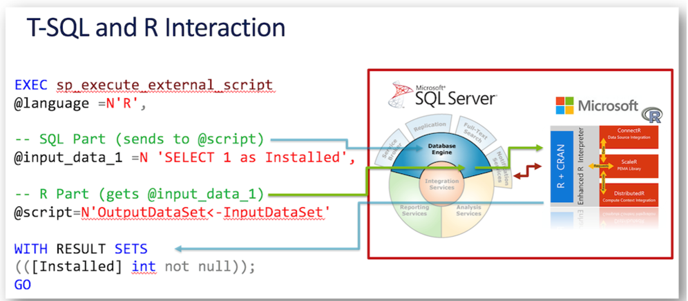

# Workshop: Unlocking AI Potential for the Data Professional with Azure OpenAI

#### <i>A Microsoft Course from Microsoft Engineering and the FastTrack Team</i>

 <h2>Module 04 - Data Integrations with the Azure OpenAI Service</h2>

Welcome to this Microsoft solutions workshop on *Unlocking AI Potential for the Data Professional with Azure OpenAI*. In this workshop, you'll learn how to unleash the full potential of artificial intelligence. Whether you’re a seasoned Data Professional or just dipping your toes into the world of machine learning, this course will empower you with the knowledge to create groundbreaking solutions.

In each module you'll get more references, which you should follow up on to learn more. Also watch for links within the text - click on each one to explore that topic.

(<a href="https://github.com/sqlserverworkshops/OpenAI-DataPro/blob/main/sqldev/00%20-%20Pre-Requisites.md" target="_blank">Make sure you check out the <b>Pre-Requisites</b> page before you start</a>. You'll need all of the items loaded there before you can proceed with the workshop.)

<h2>Topics In This Module</h2>

The following topics are covered in this module:

<dl>

  <dt><a href="#4.1" target="_blank">4.1 - Using OpenAI with Microsoft SQL Server</a><dt>
  <dt><a href="url" target="_blank">4.2 - Using OpenAI with Azure SQL DB</a><dt>
  <dt><a href="url" target="_blank">4.3 - Using Open AI with Microsoft Fabric</a><dt>

</dl>

<h2>4.1 Using Open AI with Microsoft SQL Server</h2>

Microsoft SQL Server Machine Learning Services is a feature within SQL Server that allows for the execution of R or Python code directly within the database server. This integration enables complex data science analyses to be performed quickly and securely, without the need to export data sets first. It supports advanced analytics directly within the SQL Server database engine, which can help you to build intelligent applications using scalable and fast machine learning algorithms.

It allows for **direct execution of R and Python scripts**, making it possible to perform data preparation, general-purpose data processing, and machine learning model training within the database. It also supports **failover cluster** and **partitioned data**, which can be used to generate multiple models from partitioned data using T-SQL and R/Python.

You also get **Java extensibility**, allowing for the use of Java code within SQL Server.

You can install the Machine Learning Services feature on SQL Server 2019 and later versions, including on Linux and in containers, and is also part of Azure SQL Managed Instance.

For practical applications, you can use Machine Learning Services to create and deploy machine learning models in stored procedures, which can then be used for predictive analytics, such as forecasting, classification, and clustering tasks. This feature is particularly useful for organizations looking to modernize their data science platforms to Azure or Azure SQL²(https://azure.microsoft.com/en-us/updates/machine-learning-services-on-azure-sql-managed-instance-now-generally-available/).

Additionally, SQL Server Machine Learning Services can be used securely, leveraging Azure services for organizations that might not otherwise do so, and it can help mitigate AI Prompt Injection attacks by chaining AI models together to create powerful ensemble models.

You can see a brief layout of the processing direction for the service here:
 

 

<b>Activity: Using Machine Learning Services and Python in SQL Server</b>

In this Activity, you will review a fully-reproducable Jupyter Notebook that walks through an entire OpenAI integration using SQL Server.

<b>Steps</b>

- [Open this Jupyter Notebook](https://github.com/BuckWoody/PresentationsAndBlogs/blob/master/ai_ml_dl/OpenAI-SQLML.ipynb) and review the results from the instructions and code. You can download the Notebook and enter your own credentials and other variables to run it on your system once you have [completed the pre-requisites](https://github.com/sqlserverworkshops/OpenAI-DataPro/blob/main/sqldev/00%20-%20Pre-Requisites.md).

<h2>4.2 TODO: Topic Name</h2>

TODO: Topic Description

<b>Activity: TODO: Activity Name</b>

TODO: Activity Description and tasks

<b>Description</b>

TODO: Enter activity description with checkbox

<b>Steps</b>

TODO: Enter activity steps description with checkbox

<b>For Further Study</b>

<ul>
    <li><a href="url" target="_blank">TODO: Enter courses, books, posts, whatever the student needs to extend their study</a></li>
</ul>

Congratulations! You have completed this Module.<a href="https://github.com/sqlserverworkshops/OpenAI-DataPro/blob/main/sqldev/05%20-%20DataAI%20Projects%20Best%20Practices.md"> Click this link to continue to the next Module in the Workshop</a>.
