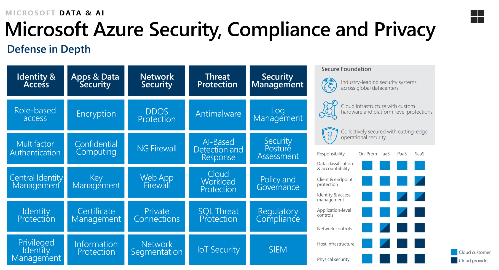
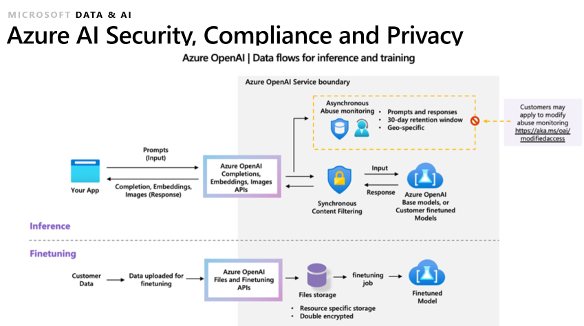
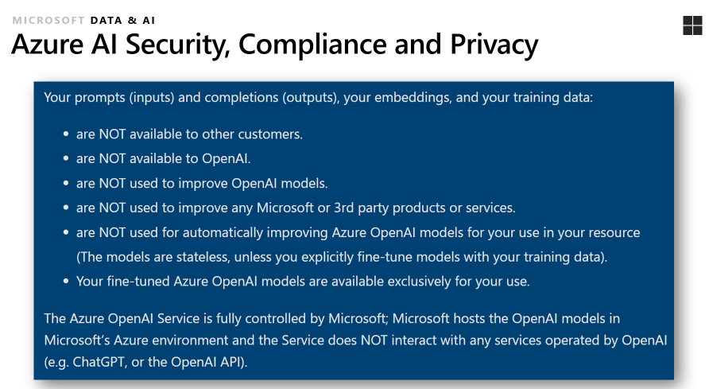

# Workshop: Unlocking AI Potential for the Data Professional with Azure OpenAI

#### <i>A Microsoft Course from Microsoft Engineering and the FastTrack Team</i>

 <h2>Module 05 - Data/AI Projects Best Practices</h2>

Welcome to this Microsoft solutions workshop on *Unlocking AI Potential for the Data Professional with Azure OpenAI*. In this workshop, you'll learn how to unleash the full potential of artificial intelligence. Whether you’re a seasoned Data Professional or just dipping your toes into the world of machine learning, this course will empower you with the knowledge to create groundbreaking solutions.

In each module you'll get more references, which you should follow up on to learn more. Also watch for links within the text - click on each one to explore that topic.

(<a href="https://github.com/sqlserverworkshops/OpenAI-DataPro/blob/main/sqldev/00%20-%20Pre-Requisites.md" target="_blank">Make sure you check out the <b>Pre-Requisites</b> page before you start</a>. You'll need all of the items loaded there before you can proceed with the workshop.)

<h2>Topics In This Module</h2>

The following topics are covered in this module:

<dl>

  <dt><a href="#5.1" target="_blank">5.1 - Security for Generative AI (GenAI) Applications</a><dt>
  <dt><a href="#5.2" target="_blank">5.2 - Responsible AI</a><dt>
  <dt><a href="#5.3" target="_blank">5.3 - A Process for Implementing AI</a><dt>

</dl>

<h2>5.1 Security for Generative AI (GenAI) Applications</h2>

It's important to recall that the foundation of AI security is proper IT platform security. Regardless of the actions you take for your environment, every access point is important. For Microsoft OpenAI, you should start with a sound understanding of the general security setup for Microsoft Azure: 

 

 

As LLMs become more easily available and integrated into our work and personal lives, the promise of the technology is tempered by the potential for it to be misused. And the potential for misuse becomes even more significant when you realize LLMs can be combined with other powerful software components and agents to orchestrate a pipeline of actions. OR combined with proprietary and personal data to introduce new avenues for data disclosure and leakage. Following the Microsoft Azure security, these additional controls are shown in this architecture diagram:  

 

 

The intention for this Module is not to reiterate security guidance that is generally available for more traditional or cloud software applications but to focus on guidance specific to *GenAI* applications and the unique characteristics and challenges of LLMs.  

## Threats & Risks
The security threats and risks with traditional software applications are familiar and understood. *GenAI* and LLMs introduce new and unique security risks including:  
* **AI responses are based on statistical probabilities** or the best chance for correct output. LLMs generate convincing human-like responses by predicting what words come next in a phrase. While they can be great at helping with tasks like summarizing a document or explaining complicated concepts or boosting creativity, there can be issues like responses being inaccurate, incomplete, inappropriate, or completely fabricated. You may be familiar with one well known example where ChatGPT provided non-existent legal citations that lawyers presented in court: [Here's what happens when your lawyer uses ChatGPT](https://www.nytimes.com/2023/05/27/nyregion/avianca-airline-lawsuit-chatgpt.html).
* *GenAI* is **by design a non-deterministic technology** which means that given identical inputs, responses and output may differ.  
* *GenAI* applications **can be extended with agents, plugins, and even external APIs that can significantly expand the attack surface** for a *GenAI* application. For instance, an LLM may implicitly trust a plugin or 3rd party component that is malicious.  
* Another challenge with GenAI is that it **currently it is not possible to enforce an isolation boundary between the data and the control planes**. This means that LLMs are not always able to differentiate between data being submitted as content or an adversarial instruction submitted as content. Think about a SQL databases: instructions are supplied through query language and validated with a parser before data is queried, manipulated, or provided as output.  With a SQL injection attack, a malicious instruction can piggyback on an ambiguously phrased language construct but it can be mitigated with a parameterized query. *GenAI*/LLMs do not have that boundary between syntax (control plane) and data so other mechanisms are needed.  

The diagram below is from [OWASP Top 10 for Large Language Model Applications](https://owasp.org/www-project-top-10-for-large-language-model-applications/assets/PDF/OWASP-Top-10-for-LLMs-2023-v1_1.pdf) and depicts the potential security risks for a hypothetical LLM app:  

## Security Strategies  
Infrastructure plays an indispensable role in helping create a secure landscape for *GenAI* applications, particularly cloud environments. Below are strategies that can help ensure the security of a *GenAI* environment:    
* **Threat Modeling** Include *GenAI* apps in your threat modeling practice. Understand that *GenAI* can extend the attack surface with access to underlying or referenced data sources, access to model API keys, workflow orchestration, and agents and plugins. Learn more about what can go wrong with [The AI Attack Surface Map v1.0](https://danielmiessler.com/p/the-ai-attack-surface-map-v1-0/).
* **Architecture strategies** help ensure  a secure, scalable, and available environment. 
  * [Baseline OpenAI end-to-end chat reference architecture](https://learn.microsoft.com/en-us/azure/architecture/ai-ml/architecture/baseline-openai-e2e-chat): a baseline architecture for building and deploying enterprise chat apps that use Azure OpenAI.
  * [OpenAI end-to-end baseline reference implementation](https://github.com/azure-Samples/openai-end-to-end-baseline): Author and run a chat app in a single region with Azure ML and OpenAI. 
* **Network strategies** help ensure that the cloud infrastructure is properly segmented and that access is controlled and monitored.  Consider network segmentation, using secure protocols, enforcing Secure APIs and endpoints.  For GenAI specific recommendations see: [Cognitive Services Landing Zone in-a-box](https://github.com/Azure/AI-in-a-Box/blob/main/ai-services/ai-landing-zone/README.md)
* **Access and Identity strategies** to enforce user verification and provide a barrier to malicious access. When possible, use managed identities and RBAC to authenticate and authorize access and avoid use of *GenAI* service API keys for access. Another consideration to keep in mind is that access patterns like role or row level access to indexes may not be natively supported. See below:  
  * [Authentication & Authorization in GenAI Apps with Entra ID & Search](https://techcommunity.microsoft.com/t5/fasttrack-for-azure/authentication-and-authorization-in-generative-ai-applications/ba-p/4022277)
  * [Azure AI Search - Restricting access to indexes](https://learn.microsoft.com/en-us/azure/search/search-security-overview#restricting-access-to-documents)
* **Application strategies** help ensure the application is configured securely and vulnerabilities are identified and addressed:
    * Use App front end services to manage access and throughput. See: [Azure OpenAI Service Load Balancing with Azure API Management](https://learn.microsoft.com/en-us/samples/azure-samples/azure-openai-apim-load-balancing/azure-openai-service-load-balancing-with-azure-api-management/) and [Smart load balancing for OpenAI endpoints and Azure API Management](https://techcommunity.microsoft.com/t5/fasttrack-for-azure/smart-load-balancing-for-openai-endpoints-and-azure-api/ba-p/3991616)
    * Ensure related services are deployed securely (AI Search, Cosmos DB, etc.)
    * Secure and validate training data and ingestion pipelines  
* **Governance strategies** help ensure that the infrastructure is being used is meeting security and compliance requirements and that policies and procedures are in place to manage risk and accountability: 
  * Become familiar with Responsible AI principles and frameworks and integrate them early in the development of your application.  For more refer to section 5.2 Responsible AI. 
  * Leverage platform capabilities for logging, auditing, and monitoring *GenAI* apps.  See: [Implement logging and monitoring for Azure OpenAI models](https://learn.microsoft.com/en-us/azure/architecture/ai-ml/openai/architecture/log-monitor-azure-openai). 
  
## Adversarial Prompting

#### Attacks
An adversarial prompt attack is when a prompt is used to manipulate an LLM in order to generate a malicious or unintended response. A sneaky user can tamper with words or sentence structure to exploit nuances or sentiment in language models. You may be familiar with some types of prompt attacks:   
* [Prompt injection](https://www.promptingguide.ai/risks/adversarial#prompt-injection): prompt input, output, or instructions are manipulated to lead to unintended behavior.  
* [Prompt leaking](https://www.promptingguide.ai/risks/adversarial#prompt-leaking): is intended to cause the model to leak confidential or proprietary information.   
* [Jailbreaking](https://www.promptingguide.ai/risks/adversarial#jailbreaking): is a technique to bypass model safety mechanisms to generate illegal or unethical content. 
* [DAN](https://www.promptingguide.ai/risks/adversarial#dan): is an acronym for **D**o **A**nything **N**ow and is another technique intended to circumvent model safety guardrails and force it to comply with requests that generate unfiltered responses.
* [Multi-prompt](https://www.lakera.ai/blog/guide-to-prompt-injection): a series of prompts are used to extract private or sensitive information.
* Multi-language: although LLMs are trained in multiple languages, performance is superior for English. This technique involves submitting a request in languages other than English to cause the model to overlook or bypass security checks.
* Obfuscation (token smuggling): a technique to present data in an unexpected format to avoid detection.  

*Note*: Details about these and other adversarial techniques can be found here:    
* [Prompt Engineering Guide](https://www.promptingguide.ai/)
* [The EL15 Guide to Prompt Injection: Techniques, Prevention Methods & Tools](https://www.lakera.ai/blog/guide-to-prompt-injection)

#### Mitigations
As a mitigation strategy for adversarial prompt attacks, consider advanced [prompt engineering techniques](https://learn.microsoft.com/en-us/azure/ai-services/openai/concepts/advanced-prompt-engineering). There is a growing list of specific techniques that can be used that include enriching prompts with specific instructions, formatting, and providing examples of the kind of output content that is intended.  Below are some techniques to consider:  
  * **Defensive Instructions**: Guide model response with explicit instructions. Structure the [system message](https://learn.microsoft.com/en-us/azure/ai-services/openai/concepts/advanced-prompt-engineering?pivots=programming-language-chat-completions#system-message) with context and instructions. See also: [Add defense in the instruction](https://github.com/dair-ai/Prompt-Engineering-Guide/blob/main/guides/prompts-adversarial.md#add-defense-in-the-instruction).
  * **Determine intent**: Use techniques like [few-shot learning](https://learn.microsoft.com/en-us/azure/ai-services/openai/concepts/advanced-prompt-engineering?pivots=programming-language-chat-completions#few-shot-learning) to provide content to the model and help set intent. 
  * **Monitor for degradation in output quality**: a decline in output quality can be an indication that a prompt has been tampered with. Monitor the model for output quality using metrics to measure and evaluate the prompt or human-in-the-loop to evaluate feedback or adversarial test cases to confirm prompt resilience. [Azure Machine Learning prompt flow](https://learn.microsoft.com/en-us/azure/machine-learning/prompt-flow/overview-what-is-prompt-flow?view=azureml-api-2) has built-in evaluation flows that enable users to assess the quality and effectiveness of prompts. 
  
  * **Use other models or dedicated services to process requests**. [Azure AI Content Safety](https://learn.microsoft.com/en-us/azure/ai-services/content-safety/) is an azure service that provides [content filtering](https://learn.microsoft.com/en-us/azure/ai-services/openai/concepts/content-filter?tabs=warning%2Cpython). AI models are used to detect and classify categories of harm from AI-generated content.  Content filters are more contextually aware than blocklists and can provide broad coverage without the manual creation of rules or lists. 
  * **Use inbound/outbound block/allow lists or filters or rules**. When there is a need to screen for items specific to a use case, blocklists can be helpful and can be implemented as part of the AI Content Safety service. See: [Use a blocklist in Azure OpenAI](https://learn.microsoft.com/en-us/azure/ai-services/openai/how-to/use-blocklists).
  * Use the native power of models to **steer zero- or few-shot prompting** strategies. See [promptbase](https://github.com/microsoft/promptbase) for a growing collection of resources, best practices, and sample scripts.  

See [Exploring Adversarial Prompting and Mitigations in AI-Infused Applications](https://www.linkedin.com/pulse/exploring-adversarial-prompting-mitigations-alex-morales-3sqne/) for more specifics on these types of attacks and defense tactics. 
  
You can see more about privacy and compliance in the Microsoft Azure OpenAI service here: 

 

 

- [Open this Jupyter Notebook](https://github.com/sqlserverworkshops/OpenAI-DataPro/blob/main/notebooks/Notebook%20-%20Module%205.ipynb) and review the results from the instructions and code. You can download the Notebook and enter your own credentials and other variables to run it on your system once you have [completed the pre-requisites](https://github.com/sqlserverworkshops/OpenAI-DataPro/blob/main/sqldev/00%20-%20Pre-Requisites.md).

<h2>5.2 Responsible AI</h2>

# Guidance: Responsible AI (RAI)

## Introduction
There is a lot to be excited about with recent advances in AI and LLM technology, but every day there are examples in the media about where and how it has gone wrong. As AI is integrated into more of our daily work and personal lives it can cause minor inconveniences, such as mistakenly canceled appointments, to more serious issues, such as potential job displacement and privacy compromises — and may even compound already existing social or economic inequities. All of us who design, develop, and deploy AI have a responsibility to confront the risks that the technology introduces.

**If your team makes use of AI APIs or AI systems or designs, develops, or deploys AI, please consider joining us in the commitment to innovate responsibly.**  This page contains recommendations and guidance for how to get started.  

## Get Started
RAI sounds promising.  Who wouldn't want their product to be responsible or trustworthy?  But there can be challenges:
* AI systems are complex and require a diversity of teams, skills, and tools
* Potential harms and risks of AI systems are different from those of traditional software systems
* Leadership support is crucial for a sustainable RAI practice
  
The recommendations that follow are based on lessons learned from rolling out a responsible AI practice across one of the organizations within Microsoft. As you review the recommendations, keep in mind they should be *adapted to fit your organization, circumstances, and product plans*. 

The approach used was grounded in principles, standards, practices that were used internally and are published here:   
* **[Microsoft AI principles](https://www.microsoft.com/en-us/ai/principles-and-approach)** of fairness, reliability and safety, privacy and security, inclusiveness, transparency, and accountability. However your organization defines and prioritizes the principles, they become the foundation for RAI standards and practices. 
* **[Microsoft Responsible AI Standard, v2](https://query.prod.cms.rt.microsoft.com/cms/api/am/binary/RE5cmFl)**: The RAI standard is the first step in putting the principles into practice.  It answers the question... *How are we going to execute on a responsible AI practice...?*. For each principle, the standard sets out concrete steps and outcomes. 
* **[Microsoft Responsible AI Impact Assessment Template](https://query.prod.cms.rt.microsoft.com/cms/api/am/binary/RE5cmFk)** and **[Impact Assessment Guide](https://blogs.microsoft.com/wp-content/uploads/prod/sites/5/2022/06/Microsoft-RAI-Impact-Assessment-Guide.pdf)** provides documentation and guidance for how a team can capture and document the benefits, potential harms and mitigations for an AI system.  
* **RAI tools and guidance** such as the Responsible AI Maturity Model, HAX Toolkit, RAI Toolbox, and more (link [here](https://aka.ms/rai)).
  
## Complete an impact assessment
A RAI impact assessment is the process a product team follows to identify and assess the potential risks and harms of an AI system.  It is a new process, and some organizations may be reluctant to consider it, giving reasons such as:
* *It is still too early in AI lifecycle to do impact assessments. RAI is mostly academic*.
* *AI is so new. How can we expect product teams to know about potential risks and harms?*
* *Discussions around RAI will only devolve into messy disagreements and take time away from design/development/deployment timelines.*

A RAI impact assessment is the primary method for guiding a team through the process of examining an AI system and aligning it to responsible AI principles and standards. The questions it examines include: *What are the use cases for the AI system? Who are the stakeholders? How do we monitor and measure AI? Who might be harmed and how? How do we prevent these harms?*

The purpose of a good RAI impact assessment is to identify the potential risks and harms of an AI system and introduce mitigations to reduce negative consequences. The templates and guidance introduced above can help a team put responsible AI principles to work.  Consider adjustments to better align with your organizational requirements and product team processes. 

Plan to update an impact assessment on an ongoing basis as use cases change, new functionality or technology is introduced, or even as the statistical property of the training data changes over time (data drift).  

## Strategies to help
The pace of AI is moving quickly and a variety of methods are needed to help measure and advance the responsible design, development, and deployment of AI systems. 

#### Adopt a layered mitigation approach for RAI
  At Microsoft, we recommend a layered mitigation approach that combines technical, operational, and governance measures to reduce the potential harms of LLMs. A layered approach applies different measures at different stages of development and deployment as documented in the article [Deploy large language models responsibly with Azure AI](https://techcommunity.microsoft.com/t5/ai-machine-learning-blog/deploy-large-language-models-responsibly-with-azure-ai/ba-p/3876792) and depicted below:
[Harms mitigation strategies with Azure AI](https://learn.microsoft.com/en-us/azure/ai-studio/concepts/evaluation-improvement-strategies) for a walk-through of the mitigation layers.  
 
#### Get started with RAI metrics 
  Measuring RAI involves both *technical attributes*, like accuracy and security, and *socio-technical attributes* such as fairness, representational harms, or safety and reliability. A starter set of metrics could include platform, usage, and operational level metrics like:
    * *resource consumption* (GPU, CPU, memory utilization, response times), 
    * *response/request tracking* (number of unique/active users, requests, prompts, token usage), and
    * *operational metrics* (quota, capacity, latency, throttling). See [Monitoring Azure OpenAI Service](https://learn.microsoft.com/en-us/azure/ai-services/openai/how-to/monitoring).

  Add to this a layer of metrics to measure the potential for RAI harms identified through the impact assessment process. Consider measuring the number of input prompts blocked, number of responses blocked, number of jailbreak attempts, or metrics related to quality of generated output such as groundedness, relevance, and similarity. 

  #### Tools to support RAI
  Tools can be a particular challenge because the RAI tools landscape is relatively new and rapidly evolving. While there are libraries and building blocks, the overall landscape can seem fragmented, making it difficult to establish an end-to-end workflow. Some of the challenges include: 
* There is no single tool that can holistically assess potential AI harms.
* Tools often do not map directly to an RAI principle or standard, such as *fairness* or *transparency*, making it difficult to determine an appropriate tool.  
* Components and libraries built to support distinct aspects of RAI practice often require additional effort to use them in a complementary way.
  
Tools to support an RAI practice for *GenAI* applications focus on model selection, prompt engineering, and model output. Recommendations include:
  *  **[Azure AI Content Safety](https://learn.microsoft.com/en-us/azure/ai-services/content-safety/)**: An azure service that provides [content filtering](https://learn.microsoft.com/en-us/azure/ai-services/openai/concepts/content-filter?tabs=warning%2Cpython). AI models are used to detect and classify categories of harm from AI-generated content.  Content filters are more contextually aware than blocklists and can provide broad coverage without the manual creation of rules or lists. 
  *  **Blocklists**: When there is a need to screen for items specific to a use case, blocklists can be helpful and can be implemented as part of the AI Content Safety service. See: [Use a blocklist in Azure OpenAI](https://learn.microsoft.com/en-us/azure/ai-services/openai/how-to/use-blocklists).
  *  **Meta-prompt best practices**: To mitigate harms, apply recommended prompt engineering practices. See: [Introduction to prompt engineering](https://learn.microsoft.com/en-us/azure/ai-services/openai/concepts/prompt-engineering) and [Prompt engineering techniques](https://learn.microsoft.com/en-us/azure/ai-services/openai/concepts/advanced-prompt-engineering).
  *  **Prompt template recommendations**: Example templates to help write effective system messages to guide AI system behavior: See [System message framework and template recommendations for Large Language Models (LLMs)](https://learn.microsoft.com/en-us/azure/ai-services/openai/concepts/system-message?source=recommendations).
  *  **Prompt flow**: [Azure Machine Learning prompt flow](https://learn.microsoft.com/en-us/azure/machine-learning/prompt-flow/overview-what-is-prompt-flow?view=azureml-api-2) is a development tool designed to streamline the entire development cycle of AI applications.  Specific to RAI are the built-in evaluation flows that enable users to assess the quality and effectiveness of prompts. 
  
 ## Resources & References
Here are additional RAI resources: 
* [Microsoft AI principles](https://www.microsoft.com/en-us/ai/principles-and-approach) 
* [Microsoft Responsible AI Standard, v2](https://query.prod.cms.rt.microsoft.com/cms/api/am/binary/RE5cmFl) 
* [Microsoft Responsible AI Impact Assessment Template](https://query.prod.cms.rt.microsoft.com/cms/api/am/binary/RE5cmFk)
* [Responsible AI tools and guidance](https://aka.ms/rai) and [HAX Toolkit](https://www.microsoft.com/en-us/haxtoolkit/)
* Video: [An introduction to responsible AI (RAI) process](https://learn.microsoft.com/en-us/shows/learn-live/fasttrack-for-azure-season-3-ep07-an-introduction-to-responsible-ai-rai-process)
* Medium articles: [Responsible AI in action, Part 1: Get started](https://medium.com/data-science-at-microsoft/responsible-ai-in-action-part-1-get-started-ee50bebbdff3?source=friends_link&sk=3a9ad40230116d9fc4c66fdf7ab56de2), and [Responsible AI in action, Part 2: Complete an impact assessment](https://medium.com/data-science-at-microsoft/responsible-ai-in-action-part-2-complete-an-impact-assessment-9b792409e8db?source=friends_link&sk=6e68eb938a2be1d776748cc55a89b663) and [Responsible AI in action, Part 3: Tools to help](https://medium.com/data-science-at-microsoft/responsible-ai-in-action-part-3-tools-to-help-969e45cac11b?source=friends_link&sk=69bfea1ae66e2b7272d58e28a49cafe4)
 

<h2>5.3 A Process for Implementing AI</h2>

Discover the pervasive influence of artificial intelligence on your daily routine. Explore the ways AI is shaping and enhancing various aspects of everyday life. Stay informed about the impact of AI technologies on your routines and habits.

## AI in Healthcare
## Medical Diagnosis and Treatment

AI technologies have made significant strides in improving the accuracy and speed of medical diagnoses and treatment recommendations. Machine learning algorithms can analyze vast datasets, including medical records, imaging scans, and genetic information, to assist healthcare professionals in identifying diseases and conditions. AI-powered diagnostic tools, such as image recognition systems for radiology and pathology, can provide early detection of illnesses and offer tailored treatment plans. This not only enhances patient care but also reduces the likelihood of misdiagnoses.

## Health Monitoring Devices

The proliferation of wearable health monitoring devices equipped with AI capabilities has revolutionized personal healthcare. These devices can continuously track vital signs, such as heart rate, sleep patterns, and activity levels, providing individuals with valuable insights into their health. AI algorithms analyze the collected data, offering personalized recommendations for improving well-being and identifying potential health issues. Such devices have become indispensable tools for proactive healthcare management.

## Drug Discovery and Research

AI is accelerating the drug discovery process, helping researchers identify promising drug candidates more efficiently. Machine learning models can predict the effectiveness of compounds, analyze molecular interactions, and even suggest novel drug targets. Additionally, AI aids in the optimization of clinical trials by identifying suitable patient populations and monitoring trial data in real-time, expediting the development of new treatments. These advancements hold the potential to bring life-saving medications to market faster and more cost-effectively.

## Email Filtering and Spam Detection
AI plays a vital role in managing the overwhelming influx of emails in both personal and professional settings. Through sophisticated algorithms, AI systems analyze email content, sender behavior, and other factors to categorize messages. This allows for the automatic filtering of spam, phishing attempts, and low-priority emails. By efficiently organizing and prioritizing incoming messages, AI-driven email filters save users significant time and effort, ensuring that they can focus on the most important communications.

In essence, AI-powered communication tools are not only transforming how we interact with technology but also how we engage with each other in an increasingly interconnected world. From instant support through chatbots to seamless language translation and effective email management, these innovations are reshaping the way we communicate in our daily lives.

## AI in Communication
## Chatbots and Virtual Assistants

Chatbots and virtual assistants have become integral parts of modern communication. These AI-driven tools are capable of understanding and responding to human queries in real time. They utilize natural language processing (NLP) algorithms to decipher user intent and provide relevant information or assistance. Whether it's on websites, messaging platforms, or mobile apps, chatbots offer immediate support, streamlining interactions and enhancing customer service experiences. Additionally, virtual assistants like Siri, Alexa, and Google Assistant are now ubiquitous in personal devices, enabling users to perform tasks, retrieve information, and even control smart home devices through voice commands.

## AI-powered Language Translation

AI has revolutionized language translation by enabling real-time, accurate conversions between different languages. Advanced algorithms, bolstered by machine learning models, have greatly improved the precision and context-sensitivity of translations. This technology has proven invaluable in breaking down language barriers in various contexts, from international business communications to travel and global collaboration. As a result, individuals and organizations alike can now communicate effectively with people from diverse linguistic backgrounds, fostering greater inclusivity and understanding.

## AI in Entertainment
## Personalized Content Recommendations

AI has revolutionized the way we consume entertainment content. Streaming platforms like Netflix and Spotify employ AI algorithms to analyze user preferences and viewing/listening habits. These algorithms then generate personalized content recommendations, ensuring that users discover new movies, TV shows, songs, and podcasts that align with their interests. This personalization enhances the overall entertainment experience and encourages users to explore a wider range of content.

## Video Game AI

Video games have become increasingly sophisticated with the integration of AI-driven elements. AI-controlled characters, also known as NPCs (non-player characters), exhibit more realistic behaviors and adapt to player actions. Game developers use AI to create challenging opponents, dynamic storylines, and immersive gaming environments. AI's role in video games extends beyond gameplay, as procedural content generation algorithms can generate diverse game levels and worlds, ensuring that players have a unique and engaging experience each time they play.

## AI-Generated Art and Music

AI has expanded its creative capabilities into the realms of art and music. Generative adversarial networks (GANs) and deep learning algorithms can produce artwork and music compositions that often blur the line between human and AI-created content. Artists and musicians are using AI tools to inspire and collaborate with, pushing the boundaries of creativity. Additionally, AI-generated art and music are finding applications in film scores, advertising, and other creative industries, showcasing the potential for AI to augment and enrich the entertainment landscape.

## AI in Finance
Artificial intelligence has ushered in transformative changes across various aspects of the industry, providing both individuals and organizations with advanced tools and capabilities.

## Automated Trading
AI-powered algorithms have revolutionized trading strategies and financial markets. These algorithms analyze vast datasets, identify patterns, and execute trades with incredible speed and precision. This technology has significantly improved liquidity, reduced trading costs, and enhanced market efficiency. Additionally, AI-driven risk assessment and fraud detection systems help financial institutions safeguard their operations.

## Personal Finance Management 
AI is empowering individuals to make smarter financial decisions. Personal finance apps and tools leverage AI to provide users with automated budgeting, expense tracking, and investment recommendations. These applications offer insights into spending patterns, savings strategies, and investment opportunities, helping users achieve their financial goals.

## Customer Service
AI-powered chatbots and virtual assistants are becoming increasingly prevalent in the financial sector. These systems handle customer inquiries, process transactions, and provide information about account balances and recent transactions, offering 24/7 support. Additionally, AI is utilized in credit scoring and loan approval processes, streamlining and expediting lending decisions.

As AI continues to evolve in finance, it's essential to address the ethical and regulatory considerations that come with its implementation, such as data privacy, bias, and fairness in algorithmic decision-making. These challenges must be carefully navigated to ensure that AI benefits both individuals and the industry as a whole.

## AI in Education
## Adaptive Learning Platforms

Adaptive learning platforms represent a significant innovation in education. These platforms utilize AI algorithms to tailor learning experiences to individual students. By continuously assessing a student's progress and understanding of the material, these systems can dynamically adjust the content, pacing, and difficulty level of lessons. This personalized approach not only enhances comprehension but also helps students stay engaged and motivated in their studies.

## Virtual Classrooms

Virtual classrooms powered by AI have become essential, especially in the context of remote and online education. AI technologies enable features like video conferencing, real-time collaboration, and automated attendance tracking. Virtual classrooms equipped with AI-driven tools facilitate interactive and immersive learning experiences, bringing students and teachers closer together, regardless of their physical locations.

## Personalized Tutoring

AI-driven personalized tutoring systems offer students additional support outside of traditional classroom settings. These virtual tutors can assist with homework, answer questions, and provide explanations on a one-on-one basis. By analyzing a student's strengths and weaknesses, these systems offer customized exercises and materials to address individual learning needs, ultimately helping students achieve their educational goals more efficiently.

 ## Resources & References
* [OWASP Top 10 for LLM applications](https://owasp.org/www-project-top-10-for-large-language-model-applications/) and the [downloadable whitepaper](https://www.llmtop10.com/assets/downloads/OWASP-Top-10-for-LLM-Applications-v1_1.pdf)
* [OWASP LLM AI Security & Governance Checklist](https://owasp.org/www-project-top-10-for-large-language-model-applications/llm-top-10-governance-doc/LLM_AI_Security_and_Governance_Checklist-v1.pdf)
* [Security Best Practices for GenAI Applications in Azure](https://techcommunity.microsoft.com/t5/azure-architecture-blog/security-best-practices-for-genai-applications-openai-in-azure/ba-p/4027885)
* [Steering at the Frontier: Extending the Power of Prompting](https://www.microsoft.com/en-us/research/blog/steering-at-the-frontier-extending-the-power-of-prompting/)
* [Planning red teaming for large language models (LLMs) and their applications](https://learn.microsoft.com/en-us/azure/ai-services/openai/concepts/red-teaming)

Congratulations! You have completed this Workshop.You can now extrapolate what you have learned to your development environments.</a>
